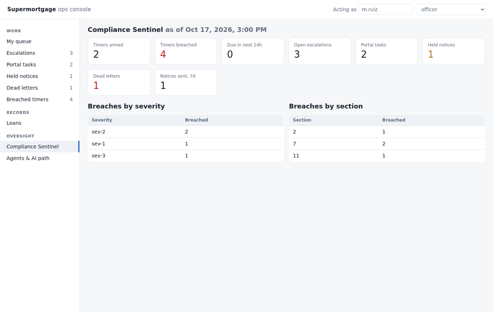
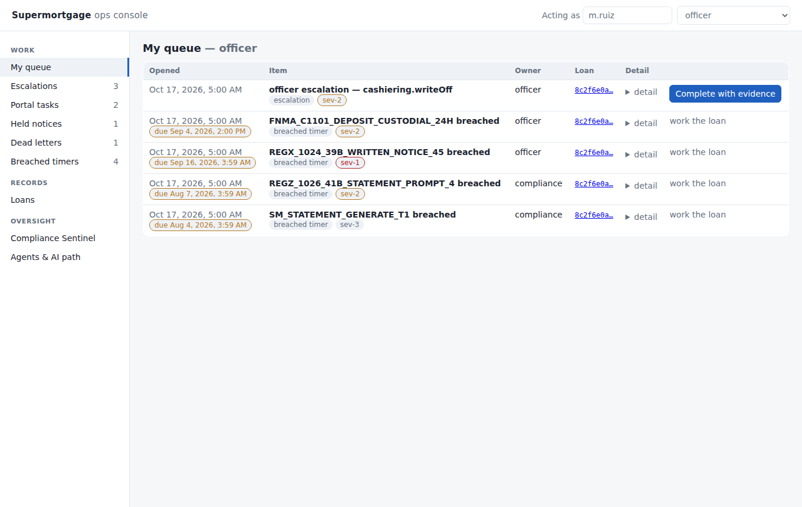
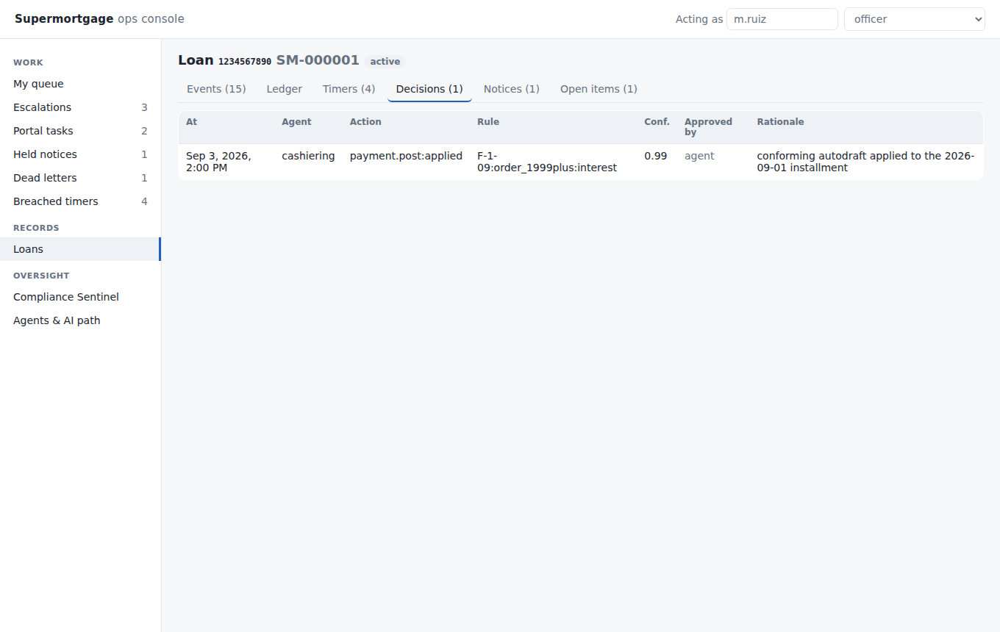
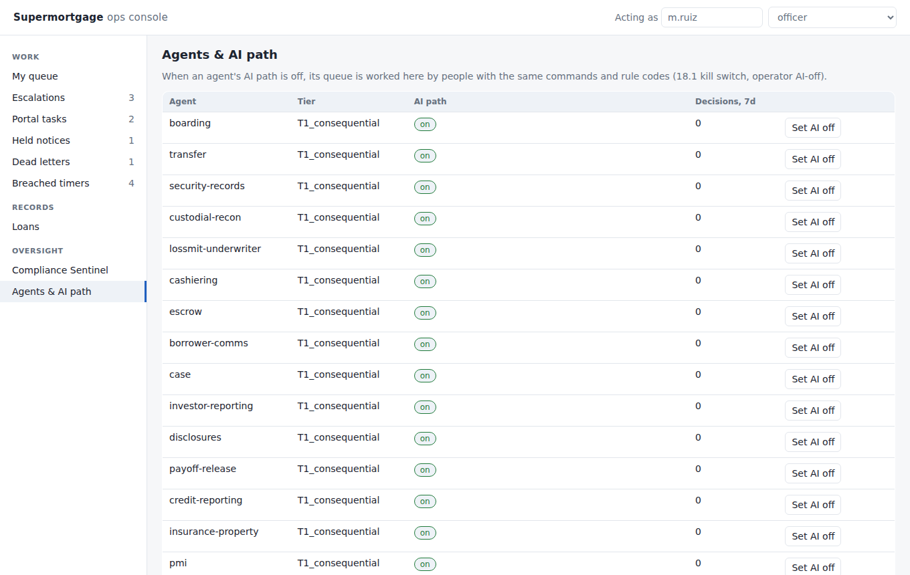

# Supermortgage

An AI-first Fannie Mae subservicing platform, built process-by-process to the
[build specification](spec/) — 19 sections, 114 processes, 1,365 timers and
gates, 1,255 acceptance tests, researched against primary sources (Reg X,
Reg Z, the Fannie Mae Servicing Guide, Lender Letters, MERS procedures).

The spec is the source of truth. Code cites it (`F-1-09:order_1999plus:interest`,
`2.2:50_rule`, `HF-003`) and the acceptance tests in each section's spec are
reproduced as the test suite.

## Layout

```
spec/                     the specification, extracted from the artifact (regenerate: npm run spec:extract)
  sections/<nn>-<slug>/   one markdown file per process, README per section
  registry/               sections.json · processes.json · timers.json (machine-readable)
src/kernel/               cross-cutting primitives every section builds on
  money/                  integer-cent bigint money, fixed-scale Decimal, amortization
  calendar/               PlainDate, federal holidays, the four day-count calendars, ET wall-clock
  events/                 append-only loan_events store + the spec's trigger-pattern syntax
  fsm/                    declarative state machines with guards and role requirements
  ledger/                 double-entry entry sets that must balance; reversal-not-edit
  timers/                 registry loader, offset grammar, arm/satisfy/breach engine
src/domain/               one directory per spec section/process
src/infra/db/             Postgres repositories + loan-scoped unit of work over db/migrations
src/infra/integrations/   outbox, adapter ports and fakes for every counterparty the spec names
src/notices/              Notice Registry: catalog, template versions, content-rule checklists, channel decision, delivery service
src/app/                  command bus, agent registry + kill switch, role gates, gate evaluators, escalations
src/console/              ops console: JSON API, in-memory and Postgres stores, single-page UI
  boarding/               §1.1 loan data intake & validation (HF/W gate, MIN, Reg X delinquency, opening ledger)
  cashiering/             §2.1 accept & post periodic payments (+ the §2.2 $50 rule)
db/migrations/            Postgres schema (bigint cents; immutable event log, ledger, decisions)
tools/                    spec extraction and registry lint
```

## Running

Node ≥ 22.18 (type-stripping, no build step) and Postgres 16.

```sh
npm install
npm test                  # node:test, all sections
npm run typecheck
npm run spec:lint         # how much of the timer registry is mechanically executable
python3 tools/extract_notices.py   # regenerate spec/registry/notices.json (notice codes) from the spec
python3 tools/extract_agents.py    # regenerate spec/registry/agents.json (agents, tools, guardrails) from the spec
npm run console -- --demo          # ops console on a seeded in-memory scenario at http://127.0.0.1:8787/
npm run console                    # ops console over Postgres (DATABASE_URL); actor from x-actor-id / x-actor-role headers
node --experimental-strip-types tools/console-screenshots.ts   # regenerate docs/console/*.png with headless Chromium
npm run test:db           # database-backed acceptance tests (needs Postgres; `npm test` skips them when none answers)
DATABASE_URL=postgresql://sm:sm@localhost/supermortgage db/migrate.sh
```

## Hosted runtime

The same tree runs as a service: `src/runtime/main.ts` is the container entrypoint (`Dockerfile`), with three modes on one image.

```sh
export DATABASE_URL=postgresql://sm:sm@localhost/supermortgage API_TOKEN=dev-token
npm run migrate           # db/migrate.sh through the entrypoint (what the Cloud Run `migrate` job runs)
npm start                 # HTTP API + ops console (page at /ops, JSON at /api/*) on $PORT (default 8080): GET /healthz, /readyz, /v1/tools, POST /v1/loans/{uuid}/tools/{process}/{name}
npm run sweep             # one pass over due timers and the outbox backlog, then exit (Cloud Scheduler runs this every minute)
```

Every route but the two probes needs `Authorization: Bearer $API_TOKEN`. A tool call hydrates the loan's entity rows, events, ledger and open timers, runs through the command bus (allowlists, roles, guardrails, decision record) and commits everything in one transaction (`src/runtime/app.ts`); refusals answer 409 with the guardrail's code and citation. `INTEGRATIONS=fake` (the only mode today) wires every vendor port to its test double.

Google Cloud hosting — Cloud Run, Cloud SQL, Secret Manager, a load balancer with Cloud Armor, deploys from GitHub Actions over Workload Identity Federation — is in `infra/` and documented step by step in [docs/DEPLOY.md](docs/DEPLOY.md).

## Status

These numbers come from `npm run audit` (`tools/audit.py`), which measures the tree against `spec/registry/manifest.json`, the spec in its own units. They are regenerated into [docs/audit/COVERAGE.md](docs/audit/COVERAGE.md) on every run and ratcheted by `npm test` against [docs/audit/baseline.json](docs/audit/baseline.json). The platform spine (kernel, timer engine, migrations, outbox and adapters, Notice Registry, command bus, ops console, persistence) exists and is tested; the table says how much of the spec's content sits on it.

| Unit of the spec | Built / spec |
|---|---|
| T-numbered acceptance tests (one verbatim `node:test` each) | 677/1253 |
| Data-model tables created by a migration | 431/450 |
| Timer codes the engine can arm and satisfy | 720/1365 |
| Notice templates authored with content and layout rules | 6/248 |
| Agent tools registered as commands on the bus | 0/658 |
| Worked-example money figures reproduced by a test | 268/624 |
| **All spec units** | **2102/4598** |
| Processes at 100% of their units | 0/114 |

| Section | Units built / spec | Processes at 100% |
|---|---|---|
| §1 | 137/250 | 0/7 |
| §2 | 125/224 | 0/7 |
| §3 | 160/334 | 0/9 |
| §4 | 91/205 | 0/5 |
| §5 | 126/293 | 0/7 |
| §6 | 99/169 | 0/5 |
| §7 | 108/206 | 0/6 |
| §8 | 68/131 | 0/3 |
| §9 | 125/286 | 0/9 |
| §10 | 103/198 | 0/6 |
| §11 | 98/252 | 0/5 |
| §12 | 154/425 | 0/9 |
| §13 | 131/353 | 0/9 |
| §14 | 75/224 | 0/4 |
| §15 | 84/241 | 0/4 |
| §16 | 77/197 | 0/4 |
| §17 | 96/204 | 0/4 |
| §18 | 116/181 | 0/7 |
| §19 | 129/225 | 0/4 |

Each domain module is pure business logic (typed inputs → typed results). Its acceptance tests live in `src/domain/<section>/<n>-<m>.spec.test.ts`, one `node:test` per T-id named exactly as the spec; a `todo: true` line there is a T-id the spec names that nothing implements yet (`npm run spec:scaffold` creates missing files and never overwrites). The hands-on defect list is in [docs/audit/AUDIT-REPORT.md](docs/audit/AUDIT-REPORT.md).

See [docs/ARCHITECTURE.md](docs/ARCHITECTURE.md) for how a section is added and
which conventions are non-negotiable.

## Audit

`docs/audit/AUDIT-REPORT.md` is the end-of-build audit against the spec (coverage numbers from
`npm run audit`, defects from a rule-by-rule reading of eight engines). Read it before trusting the
status table above: the spine is faithful, the per-section depth is not complete.

## Ops console

The console is the spec's "human path": when an agent's AI path is off (18.1 kill switch or an operator toggle) the same queues are worked by people with the same commands and rule codes. Roles come from `x-actor-id` / `x-actor-role` (set at the edge by the 19.2 identity provider; the UI's role picker in development). `auditor` and `examiner` are read-only and every request is written to `access_log`.

| Screen | |
|---|---|
| Compliance Sentinel |  |
| My queue (officer) |  |
| Loan record → decisions |  |
| Agents & AI path |  |
