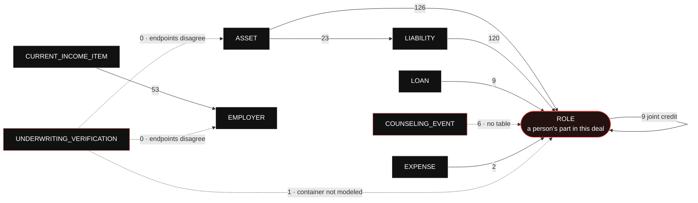

# A DU submission is a graph

What Desktop Underwriter receives is not a nested document with an
`ASSET` inside a `BORROWER`. It is a flat set of containers, each carrying an
`xlink:label`, plus a `RELATIONSHIPS` block whose `RELATIONSHIP` elements arc
between those labels by arcrole URI.

```xml
<ASSET xlink:label="ASSET_1"> … </ASSET>
<ROLE  xlink:label="PARTY_1_ROLE"> … </ROLE>
…
<RELATIONSHIP
  xlink:from="ASSET_1"
  xlink:to="PARTY_1_ROLE"
  xlink:arcrole="urn:fdc:mismo.org:2009:residential/ASSET_IsAssociatedWith_ROLE" />
```

That is the whole reason section 23.5 models ownership with join tables and
foreign keys rather than by nesting rows under a borrower. **Every arc below is
a thing our database has to be able to answer, and an arc we cannot answer is a
submission we cannot assemble.**

The spec of record is `spec/sections/23-desktop-underwriter-and-the-credit-decision/`:
23.5 (the graph), 23.6 (the emitted document), 23.7 (preflight and the port).
What is built against it is measured, never remembered — see
[docs/audit/COVERAGE.md](audit/COVERAGE.md).

## The eleven arcs

`src/domain/underwriting/du/generated/arcroles.ts` is generated by
`tools/build-du.mjs` from Fannie's ArcRoles tab (the corpus under
`src/infra/integrations/du-schema/`) and re-verified by `npm run du:verify` at
the end of every test run. It holds **eleven** arcs; **nine** of them appear
across the eighteen shipped sample submissions, in 349 instances.

Eleven, not twenty-three: the tab's raw row count includes a three-row header
and blank rows, and an earlier reading of the same tab produced 82. The number
is generated and re-counted on every build precisely so nobody has to trust a
figure typed into a document — including this one.



`ROLE` is the hub, and that is the shape of the domain rather than an accident
of the diagram: a role is a person's part in this deal, and almost everything in
a mortgage belongs to somebody. Six of the eleven arcs end there.

The self-loop is `ROLE_SharesJointCreditReportWith_ROLE` — two borrowers on one
credit report. It is the only arc whose ends are the same container, which is
why it needs a table of its own rather than a column.

## Where each arc lives

**342 of the corpus's 349 arc instances are of kinds the database holds.** The
seven that are not are six counseling events and one verification arc.

| Arc                                                   | In corpus | Where it lives here                            |
| ----------------------------------------------------- | --------: | ---------------------------------------------- |
| `ASSET_IsAssociatedWith_ROLE`                         |       126 | `du_asset_parties`                             |
| `LIABILITY_IsAssociatedWith_ROLE`                     |       120 | `du_liability_parties`                         |
| `CURRENT_INCOME_ITEM_IsAssociatedWith_EMPLOYER`       |        53 | `application_income.employer_id` → `employers` |
| `ASSET_IsAssociatedWith_LIABILITY`                    |        23 | `du_liabilities.secured_by_owned_property_id`  |
| `ROLE_SharesJointCreditReportWith_ROLE`               |         9 | `du_joint_credit_report_links`                 |
| `LOAN_IsAssociatedWith_ROLE`                          |         9 | `application_borrowers.borrower_ordinal`       |
| `COUNSELING_EVENT_IsAssociatedWith_ROLE`              |         6 | **nothing**                                    |
| `EXPENSE_IsAssociatedWith_ROLE`                       |         2 | `du_expense_parties`                           |
| `UNDERWRITING_VERIFICATION_IsAssociatedWith_ROLE`     |         1 | **nothing**                                    |
| `UNDERWRITING_VERIFICATION_IsAssociatedWith_ASSET`    |         0 | **nothing** (disputed endpoints)               |
| `UNDERWRITING_VERIFICATION_IsAssociatedWith_EMPLOYER` |         0 | **nothing** (disputed endpoints)               |

All of it is created by `db/migrations/0133_du_graph.sql`; the 0057 rows the
origination sections used to write (`application_assets`,
`application_liabilities`, `application_reo`) are views over the graph since
`0134_du_projections.sql`, so nothing reads a shape the emitter does not.

Four of those rows carry a decision worth knowing before you change them.

**Ownership is a join table, not a column,** for the three arcs that end at
`ROLE` from an owned thing. An asset can have more than one owner, and a
deferred trigger (`DU_GRAPH_ORPHAN`) refuses a COMMIT that leaves an asset,
liability or expense with none — so an arc we would have to emit cannot fail to
exist by the time we emit it. A second deferred trigger
(`DU_GRAPH_CROSSES_APPLICATIONS`) refuses an arc whose two ends sit on different
applications.

**`ASSET_IsAssociatedWith_LIABILITY` is a foreign key and not a join table,**
and the corpus is the argument: across all eighteen samples no liability is the
target of more than one asset, while one property carrying two liens — a first
mortgage and a HELOC — is ordinary. A nullable foreign key on the liability side
expresses exactly that and nothing more; `du_owned_properties.lien_upb_cents` is
the sum of the live liens it secures, maintained by trigger, never written by a
caller.

**The employer arc is derivable rather than stored twice.**
`application_income.employment_income` is true exactly when the row names an
employer, bound by a CHECK, so the indicator DU reads and the arc DU reads
cannot disagree. Employer identity is the EIN when one is known (`EIN_WINS`:
one name under two EINs is two employers), else the normalized name.

**Counseling is absent on purpose.** We provide no housing counseling, so there
is no event to record. It becomes required rather than optional the day we offer
HomeReady — and because it is an arc rather than a field, it cannot be added to
a submission as an afterthought.

Beyond the arcs, 23.5 keeps three more facts the document needs: declarations
are only ever the borrower's own words (`du_declarations`, refused unless the
actor is that borrower — `DU_DECLARATION_NOT_SELF_ATTESTED`; a Yes to bankruptcy
requires a `du_bankruptcy_filings` row and a No forbids one), a residence has a
basis (`du_residences`: own, rent with the amount, rent-free), and DU's own
casefile identifier is written once (`applications.du_casefile_id`,
`DU_CASEFILE_ID_WRITE_ONCE`).

## The two arcs whose endpoints disagree

`UNDERWRITING_VERIFICATION_IsAssociatedWith_ASSET` names `OWNED_PROPERTY_DETAIL`
in its endpoint row and `ASSET` in its arcrole URI. The `…_EMPLOYER` arc
disagrees the same way, between `EMPLOYMENT` in its XPath and `EMPLOYER` in its
target.

The generator emits every name the tab gives each endpoint and marks the arc
`disputed: true`. **It picks no winner, and nothing downstream may pick one
silently.** The emitter (23.6) skips a disputed arc rather than guess. Which
element carries the label is a question for Fannie Mae; an emitter that guessed
would produce a document that validates and means something we did not intend.

Both disputed arcs are also the two that no shipped sample exercises. That is
either a coincidence or a clue, and it is recorded here as neither.

## What schema validation does not buy you

The eighteen samples validate against the vendored chain on every CI run
(`src/infra/integrations/du-schema/schema.test.ts`, with `xmllint` on every
runner), and that is worth having. It is worth much less than it looks.

**All of these validate:**

- a dangling `xlink:to` pointing at a label the document does not contain
- a duplicate `xlink:label`
- an invented arcrole URI
- five borrowers, where DU permits four
- a deleted `RELATIONSHIPS` container — the entire graph removed
- a document with no `LOANS` and no `PARTY`: nothing to underwrite and nobody to
  underwrite it

What the XSD does catch is lexical and local: a value outside a MISMO
enumeration, a child out of `xsd:sequence` order, an element name the model does
not know. **None of it is the graph.**

**This is the argument for why the invariants live in Postgres,** and why 23.7's
preflight exists at all. Schema validity is necessary and nowhere near
sufficient; every guarantee in the list above that a submission actually needs
is one the database is already keeping — an owner on every emittable row, one
party per borrower position, a joint-credit group that cannot contradict itself,
an arc that cannot cross two applications — and preflight re-checks the emitted
bytes for the rest (labels unique, arcs resolvable, borrowers one to four,
container limits from the generated cardinality table) before any of them reach
the port. 23.7-T2 through T5 build documents that `xmllint` accepts and
preflight refuses; the second assertion in each is the point.

## What is built, and what is not

Built, and measured at 100% of its units in COVERAGE.md:

- **23.5** — the graph above, with writers (`src/domain/underwriting/du/writer.ts`)
  that 22.2, 22.3, 22.4 and 32.2 write through.
- **23.6** — the DU Specification document (MISMO 3.4 B324), assembled from the
  graph against the generated order, cardinality, conditionality, length and
  enumeration tables (`src/domain/underwriting/du/emit.ts`), persisted through
  `documents` + `du_documents` with `sha256` of the bytes as 23.1's request
  hash. A test-only loader round-trips all eighteen Fannie samples to parity
  after whitespace and label normalization.
- **23.7** — preflight (`src/domain/underwriting/du/preflight.ts`, twelve checks
  in the spec's order, every run recorded in `du_preflight_results`), the
  `SM_DU_PREFLIGHT_GATE` timer 23.1's submit evaluates, and the port contract in
  `src/infra/integrations/du.ts`.

Not built, and honest about it: the **transport**. The port is a FAKE that
validates the bytes it is sent with the same XSD chain and answers 400 when
they fail, mints a deterministic ten-digit casefile identifier on the first
submission and returns fixture findings. The Direct Integration transport waits
on TSP onboarding and Fannie Mae's DU Error Codes document; the two disputed
arcs wait on Fannie Mae; `COUNSELING_EVENT` waits on HomeReady; the generator
still reads the DU Specification workbook from the corpus rather than a
vendored copy.
