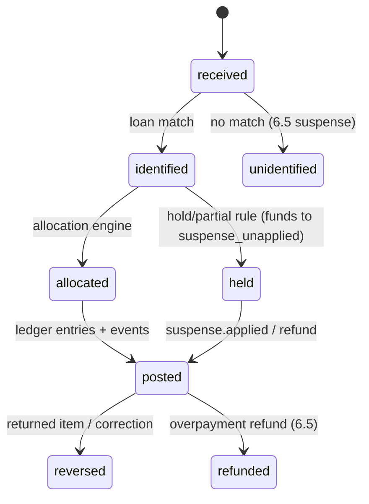

# 2.1 — Accept & post periodic payment (P&I + escrow)

| Attribute | Value |
|---|---|
| Section | 2 — Payment Processing & Cashiering |
| Automation class | a |
| SoR / Sub | Sub |
| Trigger & frequency | On payment receipt; monthly |
| Governing source | FNMA C-1.1-01; Reg Z 1026.36(c)(1) prompt crediting |
| Key deadlines | Credit as of date received |
| Timers | `FNMA_C1101_DEPOSIT_CUSTODIAL_24H`, `FNMA_C1101_LOCKBOX_CLEARING_1BD`, `FNMA_C1101_LOCKBOX_CUSTODIAL_2BD`, `FNMA_C4301_LAR_NONREMOVAL_NEXTBD_2000`, `FNMA_LL202605_EVENT_NEXTBD_0300`, `REGZ_1026_36C1III_NONCONFORMING_5CD`, `REGZ_1026_36C1_CREDIT_AS_OF_RECEIPT_POST_1BD`, `SM_1024_33C2_FORWARD_PROMPT_1`, `SM_CASHIERING_POSTING_BACKLOG_GATE` |

### Blueprint row
| Field | Value |
|---|---|
| Area | Cashiering |
| Trigger & frequency | On payment receipt; monthly |
| Governing source (blueprint) | FNMA C-1.1-01; Reg Z 1026.36(c)(1) prompt crediting |
| Key deadlines (blueprint) | Credit as of date received |
| Data/artifacts | Payment ledger; retain life + 4 yr |
| Systems | Lockbox, ACH, card rails |
| Automation class (blueprint) | a |
| SoR / Sub | Sub |
| Nuances (blueprint) | (blank in source) |

### Verified requirement (as of 2026-09-09)

**Fannie Mae Servicing Guide C-1.1-01, Servicer Responsibilities for Processing Mortgage Loan Payments (effective 04/12/2023; Guide edition Aug. 12, 2026).** The servicer must "apply scheduled payments, including late charges (if applicable), in the order specified in the security instrument"; "when multiple payments are received, each payment must be applied separately"; "ensure payments for all mortgage loans are credited upon receipt and that each portion of the payment is accounted for in its records"; "apply all funds as intended by the borrower, when applicable," and "funds intended by the borrower for first lien mortgage loans must not be reallocated as payment towards any subordinate lien"; follow FHA/VA and SCRA requirements where applicable (F-1-19 for military indulgence); notify the borrower of upcoming payment changes per the loan documents and law. Deposit rule: "deposit all funds into a custodial account in a financial institution that meets Fannie Mae's rating requirements for custodial depositories … within 24 hours of receipt"; with a lockbox agent, "the payments must be deposited into the collection clearing account no later than the 1st business day after they are received by the lockbox agent" and "the funds must be deposited into the applicable custodial account no later than the 2nd business day after the servicer's lockbox agent receives them." URL: https://servicing-guide.fanniemae.com/svc/c-1.1-01/servicer-responsibilities-processing-mortgage-loan-payments (verified 2026-09-09).

**F-1-09, Processing Mortgage Loan Payments and Payoffs (10/19/2016)** supplies the order the Guide itself defers to: for "instruments dated March 1999 or later" — "1. Interest 2. Principal 3. Deposits for escrow items … 4. Late charges"; for instruments dated before March 1999 — "1. Deposits for insurance and taxes 2. FHA service charges 3. Interest 4. Principal 5. Late charges." Interest for a fixed-rate first lien: "calculate 30 days' interest on the UPB as of the LPI date and using the current accrual rate"; biweekly: 14 days' interest; ARMs: "based on its applicable effective interest accrual date." A curtailment "submitted with" a scheduled payment: "apply the scheduled monthly payment first, then apply the principal curtailment"; submitted separately: "apply the principal curtailment first, then apply the next scheduled monthly payment." URL: https://servicing-guide.fanniemae.com/svc/f-1-09/processing-mortgage-loan-payments-and-payoffs (verified 2026-09-09).

**Uniform instruments.** Form 3200 Multistate Fixed Rate Note (07/2021): "Each Monthly Payment will be applied as of its scheduled due date and will be applied to interest before the Principal"; "I will make my Monthly Payment on the ___ day of each month"; Section 6(A) late charge "only once on each late payment" (see 2.7). URL: https://singlefamily.fanniemae.com/media/document/pdf/legal-documents/form-3200 (verified 2026-09-09). The 07/2021 security instruments (Forms 3001–3051; mandatory for note dates on/after Jan. 1, 2023 per the Uniform Instruments fact sheet, https://singlefamily.fanniemae.com/media/document/pdf/uniform-instruments) contain the Uniform Covenant 2 order — oldest outstanding Periodic Payment first, "first to interest and then to principal due under the Note, and finally to Escrow Items," remaining amounts to late charges and other amounts due, then at the lender's discretion to a future Periodic Payment or principal — and the partial-payment suspense authority ("may accept and either apply or hold in suspense Partial Payments"). **[PARTIALLY VERIFIED — the security-instrument DOCX files could not be parsed through the fetch proxy; the quoted Section 2 language is from the published 07/2021 instruments as recalled and must be confirmed against Form 3001 §2 before the allocation rule set is frozen.]** F-1-09's order is identical, so the build is not blocked.

**Reg Z 12 CFR 1026.36(c)(1) (eCFR current as of 2026-09-04).** "In connection with a closed-end consumer credit transaction secured by a consumer's principal dwelling: (i) … No servicer shall fail to credit a periodic payment to the consumer's loan account as of the date of receipt, except when a delay in crediting does not result in any charge to the consumer or in the reporting of negative information to a consumer reporting agency, or except as provided in paragraph (c)(1)(iii)." "A periodic payment, as used in this paragraph (c), is an amount sufficient to cover principal, interest, and escrow (if applicable) for a given billing cycle." (c)(1)(iii): "If a servicer specifies in writing requirements for the consumer to follow in making payments, but accepts a payment that does not conform to the requirements, the servicer shall credit the payment as of five days after receipt." Official Interpretations (consumerfinance.gov interp-36, verified 2026-09-09): comment 36(c)(1)(i)-1 — crediting as of the date of receipt "does not require that a mortgage servicer post the payment to the consumer's loan account on a particular date"; -2 — "The method by which periodic payments shall be credited is based on the legal obligation between the creditor and consumer, subject to applicable law"; -3 — "The 'date of receipt' is the date that the payment instrument or other means of payment reaches the mortgage servicer. For example, payment by check is received when the mortgage servicer receives it, not when the funds are collected"; comment 36(c)(1)(iii)-1 lists reasonable written requirements (account number/coupon, cut-off hour, mail-only checks/money orders, U.S. dollars, one address such as a P.O. box); -2: "it would be reasonable to require a cut-off time of 5 p.m. for receipt of a mailed check at the location specified by the servicer." URLs: https://www.ecfr.gov/current/title-12/chapter-X/part-1026/subpart-E/section-1026.36 ; https://www.consumerfinance.gov/rules-policy/regulations/1026/interp-36/.

**Reg X 12 CFR 1024.35(b)** (eCFR current as of 2026-09-04) makes each failure an enumerated error: (b)(1) "Failure to accept a payment that conforms to the servicer's written requirements"; (b)(2) "Failure to apply an accepted payment to principal, interest, escrow, or other charges under the terms of the mortgage loan and applicable law"; (b)(3) "Failure to credit a payment to a borrower's mortgage loan account as of the date of receipt in violation of 12 CFR 1026.36(c)(1)." Reg Z 1026.41(d)(3) requires the statement to show, for all payments received, the amounts "applied to principal, interest, escrow, fees and charges, and the amount, if any, sent to any suspense or unapplied funds account" (7.1). Reg Z 1026.36(c)(3)/Reg X 1024.36 payoff statements are 16.1.

**LL-2026-05 / Servicing Changes Reference Guide v1.0 (Dec. 17, 2025; verified 2026-09-09).** The "Loan Contractual Payment" event is "the application of a monthly P&I payment as determined per the terms of the Note/Modification, such that the loan LPI date is advanced one payment period"; attributes include Loan Servicer Transaction Effective Date ("borrower submission date"), Processed Date, LPI due date, actual UPB, non-interest-bearing balance, suspense balance, rates, P&I and a per-loan sequence number; "Servicers must report individual Loan Contractual Payment events when multiple contractual payments are processed"; a contractual payment and a curtailment processed the same day are "two separate events"; deadline "the same day … but no later than 3:00 a.m. Eastern Time on the next business day." Section 5.1 owns projection and transport; this process owns emission.

**Discrepancies with the blueprint row.** (a) The Guide does not itself fix the application order — it defers to the security instrument; the operative statement is F-1-09's table, and the platform must carry two order profiles (pre-/post-March 1999 instruments). (b) "Credit as of date received" is right but incomplete: non-conforming payments may be credited five days after receipt, the deposit clock is 24 hours (lockbox: 1 BD to clearing, 2 BD to custodial), and misdirected payments during the 60-day transfer window are credited as of the transferor's receipt (1024.33(c)). (c) Reg Z 1026.36(c) reaches only loans secured by a consumer's principal dwelling; the platform applies the same standard to every loan by policy (investment-property loans are not exempt from Fannie Mae's "credited upon receipt" rule). (d) "Card rails" are not a Fannie Mae-recognized channel; see the card policy in Business rules and Open question 2.1-Q3. (e) Retention: A2-5-01 life of loan + 4 years applies; Reg X 1024.38(c) adds one year after transfer/discharge (19.1).

### Operational prerequisites
- **Custodial accounts In Effect** (6.1/6.2): P&I account per remittance type, T&I account, and a `ti_unapplied` account; collection **clearing account** at an eligible depository titled "for the benefit of Fannie Mae" (A4-1-02/F-1-03) — Supermortgage treasury; 4–8 weeks.
- **Lockbox contract** (bank lockbox with imaging, OCR-A scanline reads, daily remittance file + images by SFTP/PGP, 5:00 p.m. local mail cut-off) — Supermortgage; 6–10 weeks; artifact: lockbox service agreement and file-layout spec (`lockbox` adapter contract test).
- **ODFI origination agreement** naming Supermortgage as Originator (PPD/WEB/TEL debits, PPD/CCD credits), with exposure limits, return-rate monitoring and Same-Day ACH; account-validation vendor (instant verification API) — Supermortgage; bank underwriting 4–8 weeks (see 2.3).
- **Written payment requirements** (Reg Z 1026.36(c)(1)(iii)) approved by compliance and reproduced in the hello notice (1.3), statements/coupons (7.1) and the borrower portal: remittance address (lockbox P.O. box), cut-off times, instrument types, loan number requirement, U.S. dollars — Supermortgage; before first boarding.
- **Loan terms boarded** (1.1): due day, P&I, escrow payment, application-order profile (`instrument_profile` ∈ {uniform_1999_plus, pre_1999}), late-charge terms, remittance type, non-interest-bearing balances, biweekly/DSI flags.
- **Partner acknowledgement** of Supermortgage as payee and Originator (subservicing agreement clause) and of the daily exception digest recipient list — Partner SoR; contract.
- **Telephony/IVR and portal** payment channels with AI disclosure and E-SIGN consent flows (7.4) — Supermortgage; Stage 1.

### Build spec
#### Inputs and triggers
- Channel intake records: `lockbox.batch.received` (daily file + images), `ach.settlement.received` (our originated debits settle — 2.3), `ach.credit.received` (inbound WEB/PPD/CCD credits, bank bill-pay), `wire.received`, `portal.payment.submitted` (one-time ACH via web/mobile), `ivr.payment.submitted`, `agent.payment.submitted` (borrower-comms), `mail.check.received` (office mail — non-conforming), `card.payment.authorized` (only if the card channel is enabled — default off), `third_party.remittance.received` (2.5 contractors, HAF/mortgage-assistance programs, bankruptcy trustees), `payment.received{received_by='transferor'}` (1.3 misdirected-payment file).
- Loan-state inputs read at allocation time: `loan_terms` (effective-dated), ledger balances, open `suspense_items`, overlay flags from `cases` (forbearance, repayment, trial, bankruptcy, foreclosure, scra, noe), `transfer_in` window, `payment_holds`.
- Schedules: `cashiering.posting.sweep` every 15 minutes (posts anything received and identified); `cashiering.deposit.watch` hourly (24-hour/1-BD/2-BD deposit evidence); `cashiering.eod.cutoff` at the written cut-off time per channel (sets `received_on` for the day's items).

#### Data model
`payments` (baseline table, fixed here; all money `bigint` cents; retention `life_of_loan_plus_4y`; payer bank data encrypted):

| Field | Type / constraint |
|---|---|
| `id`, `loan_id?` (null until identified), `custodial_account_id?` | — |
| `channel` | enum {lockbox, ach_debit_origin, ach_credit_inbound, wire, portal_onetime, ivr, agent_assisted, mail_office, card, third_party_contractor, assistance_program, bk_trustee, transferor_forward, transfer_in_opening} |
| `instrument` | enum {check, money_order, cashiers_check, ach, wire, card_debit, card_credit, book_transfer} |
| `amount_cents` | > 0 |
| `received_at timestamptz`, `received_on date` | `received_on` = Reg Z date of receipt (channel rule below) |
| `credited_as_of date` | = `received_on` (+5 calendar days if `nonconforming` and policy elects; = transferor receipt date for `transferor_forward`) |
| `conforming bool`, `nonconforming_reason?` | per written payment requirements |
| `designation` | enum {unspecified, contractual, curtailment, escrow_only, fees_only, trial, payoff, reinstatement, biweekly_half} |
| `borrower_instruction_text?`, `instruction_source` | coupon box / portal field / call transcript ref |
| `payer_type` | enum {borrower, coborrower, successor, third_party, contractor, program, trustee, transferor} |
| `payer_name`, `payer_bank_last4`, `check_number?`, `trace_number?` (ACH), `image_document_id?` | PII encrypted |
| `idempotency_key` | unique: sha256(channel|source_batch_id|source_item_id|amount|received_on) |
| `status` | enum {received, identified, held, allocated, posted, reversed, returned, refunded} |
| `allocation_outcome` | enum {applied, applied_with_50_rule, curtailment, prepaid, unapplied, held_trial, held_bk, held_fc, held_dispute, refunded, payoff_routed} |
| `source_batch_id?`, `source_item_id?`, `settlement_date?`, `good_funds_at?` | — |

`payment_allocations` (baseline, fixed): `payment_id`, `sequence` (int), `installment_due_date` (date; null for curtailment/fees), `bucket` ∈ {interest, principal, escrow, late_charge, nsf_fee, other_fee, curtailment, suspense, deferred_principal, forborne_principal, corporate_advance, escrow_advance}, `amount_cents`, `ledger_entry_set_id`, `rule_ref` (e.g., `F-1-09:order_1999plus:interest`), `credited_as_of`.

New tables: `payment_channels` (channel config: cut-off time/tz, written requirement text version, conforming flag rules); `payment_requirements` (versioned text of the Reg Z (c)(1)(iii) requirements with effective dates and the notices that carried them); `payment_holds` (`loan_id`, `hold_type` ∈ {bankruptcy, foreclosure_post_referral, noe_dispute, fraud, deceased_estate, payoff_pending, transfer_out_cutover}, `owner_case_id`, `set_by`, `released_at`); `custodial_deposits` (`payment_id[]`, `custodial_account_id`, `clearing_deposited_at`, `custodial_deposited_at`, `bank_reference`, `evidence_document_id`); `loan_installments` (projection: `loan_id`, `due_date`, `pi_cents`, `interest_cents`, `principal_cents`, `escrow_cents`, `status` ∈ {due, satisfied, prepaid, deferred, forborne}, `satisfied_on`, `credited_as_of`, `late_charge_state` (2.7)).

Ledger accounts used (baseline §5): loan `principal`, `interest_due`, `escrow`, `suspense_unapplied` (the baseline's `suspense/unapplied`), `late_charges`, `nsf_fees`, `other_fees`, `deferred_principal`, `forborne_principal`; custodial `clearing_cash`, `custodial_pi_cash`, `custodial_ti_cash`, `custodial_ti_unapplied_cash`; corporate `servicing_fee_income`, `late_charge_income`, `nsf_fee_income` (the P&I/servicing-fee split of `custodial_pi_cash` and the Fannie Mae payable are Section 5.2/6.3's postings).

#### State machine
`payments.status`: `received` → `identified` (loan matched: scanline/loan number/ACH enrollment/portal session; unmatched items go to 6.5 as `suspense_items{reason=unidentified_*}`) → {`allocated` → `posted`} | `held` (a `payment_holds` row or 2.2/2.6 rule places funds in `suspense_unapplied`; posting still happens — cash is always posted the day it is received) → later `posted` via `suspense.applied`; `posted` → `reversed` (Reversal Engine: returned item, misapplication) | `refunded` (6.5). Terminal: `posted` (final), `reversed`, `refunded`, `returned`. Transitions are made by the `cashiering` agent's commands (`payment.receive`, `payment.identify`, `payment.allocate`, `payment.post`) — never by humans editing rows; `human_agent` can only re-run commands with a documented instruction.

#### Timers and gates
| Timer code | Kind | Trigger event | Anchor | Offset & unit | Satisfied by | Breach action |
|---|---|---|---|---|---|---|
| `REGZ_1026_36C1_CREDIT_AS_OF_RECEIPT_POST_1BD` | deadline | `payment.received` | `received_on` | 1 `business_days_servicer` (internal posting SLA; the legal test is that `credited_as_of` = `received_on`) | `payment.posted` with `credited_as_of ≤ received_on` (+5 if nonconforming) | sev-2 → `cashiering`; any late charge or credit-reporting run is blocked until the backlog is posted |
| `FNMA_C1101_DEPOSIT_CUSTODIAL_24H` | deadline (canonical code; 6.1 carries this row verbatim) | `payment.received{received_by≠lockbox_agent}` (office mail, wire, ACH credit landing in clearing) | `received_at` | 24 hours from receipt, **rolled to the next servicer business day 17:00 local when the 24-hour point falls on a non-business day**. *This is a documented interpretation, not the literal text.* C-1.1-01 says only: "deposit all funds into a custodial account in a financial institution that meets Fannie Mae's rating requirements for custodial depositories … within 24 hours of receipt" — it states no non-business-day rule, and a custodial depository cannot post a credit on a weekend or federal banking holiday. The platform therefore runs the 24-hour clock to the next available banking opportunity rather than recording an unattainable Saturday/Sunday deadline as a breach; a literal clock-hour reading would flag every Friday-afternoon and weekend receipt. Lockbox receipts are **not** on this timer (they use the 1-BD/2-BD rows below) | `custodial_deposits.custodial_deposited_at` / `custodial.deposit.confirmed` (bank credit matched) | sev-2 → `custodial-recon`; daily digest to partner; `officer` if > 5 breaches/month |
| `FNMA_C1101_LOCKBOX_CLEARING_1BD` | deadline | `lockbox.batch.received` | lockbox receipt date | 1 `business_days_servicer` | `custodial_deposits.clearing_deposited_at` | sev-2 |
| `FNMA_C1101_LOCKBOX_CUSTODIAL_2BD` | deadline | `lockbox.batch.received` | lockbox receipt date | 2 `business_days_servicer` | `custodial_deposits.custodial_deposited_at` | sev-1 (Guide breach; partner notified) |
| `REGZ_1026_36C1III_NONCONFORMING_5CD` | rule (not a deadline) | `payment.received{conforming=false}` | `received_on` | +5 calendar days = latest permitted `credited_as_of` | posting | posting command rejects `credited_as_of > received_on + 5` |
| `SM_1024_33C2_FORWARD_PROMPT_1` | (from 1.3) | `payment.received{received_by='transferor'}` | transferor receipt | 1 BD | `payment.posted` | (1.3) |
| `SM_CASHIERING_POSTING_BACKLOG_GATE` | not_before_gate | daily `late_charge.assessment.run` (2.7), `credit_reporting.cycle` (8.1), `payment.none` sweep (5.1) | — | zero items in `received/identified` with `received_on ≤ gate date` | — | the dependent job waits; sev-3 after 2 hours |
| `FNMA_LL202605_EVENT_NEXTBD_0300` | (5.1 owns) | `investor_events.created` where `mode=event` (LL-2026-05 near-real-time servicing events) | `processed_at` | next `fannie_et` BD **03:00 ET** | `submitted` | (5.1) sev-2 |
| `FNMA_C4301_LAR_NONREMOVAL_NEXTBD_2000` | (5.1 owns) | `investor_events.created` (legacy LAR family — payment/nonpayment, non-removal) | `processed_at` | next business day **20:00 America/New_York** (`business_days_fannie_et`, 1) | `investor_events.submitted` (same event) | (5.1) warn 70%; breach → escalation `investor-reporting` sev-2, Compliance Sentinel daily report |

Jurisdiction overrides: none for this process (state late-charge and fee rules are in 2.7).

#### Business rules and calculations
1. **Date of receipt (`received_on`) by channel.** Lockbox: the lockbox agent's receipt date (the agent is the servicer's agent — comment 36(c)(1)(i)-3), items scanned after the 5:00 p.m. local cut-off dated the next business day; office mail: date received in the mailroom (nonconforming — see rule 3); our originated ACH debits: the scheduled settlement date (2.3); borrower-initiated portal/IVR/agent ACH: the date the borrower submitted the instruction before the channel cut-off (11:59 p.m. ET, portal) — credited as of that date, conditional on settlement (a return reverses it, 2.1 rule 9); inbound ACH credits/wires: the settlement/value date on the bank statement; transferor-forwarded: the transferor's receipt date (1024.33(c)). `received_on` is immutable once set; corrections are reversals.
2. **Periodic payment P** = `loan_terms.pi_cents + loan_terms.escrow_payment_cents` (Reg Z definition; Fannie Mae "full PITI"), effective-dated (escrow changes from 3.2, ARM changes from 7.2). Optional add-ons (buydown, escrow-shortage installment) are part of `escrow_payment_cents` as configured by 3.6.
3. **Conformity.** A payment is conforming if it reaches the specified address/channel, in U.S. dollars, by an accepted instrument, with an identifiable loan. Non-conforming payments are accepted (never refused because of form alone) and, by default policy, still credited as of the actual date of receipt (more favorable than the five-day allowance); the +5-day option is retained as a configurable fallback per channel (`payment_channels.nonconforming_credit_days`, default 0).
4. **Identification.** Deterministic match on scanline/loan number/ACH authorization/portal session; fuzzy matching and unidentified items are 6.5's engine; cash is posted to `clearing_cash`/`suspense_unapplied` on the receipt date regardless of identification status.
5. **Allocation (Allocation Engine, rule set `cashiering.allocation.v1`).** Inputs: available funds A = payment amount + any open `suspense_unapplied` balance not under a hold. Overlays checked first: `payment_holds` (bankruptcy → 14.x plan rules; foreclosure post-referral → 13.x reinstatement rules; NoE dispute → hold; payoff pending → 16.x), trial (2.6), forbearance/repayment (12.4/12.5 — payments under a plan are applied to the oldest due installment; no suspense unless < P). If `designation = payoff` → 16.2. Else: `n = floor(A / P)` installments applied oldest-first (FIFO, the instrument's "order in which it became due"); each installment allocated per `instrument_profile`: `uniform_1999_plus` → interest, principal, escrow, then late charges; `pre_1999` → escrow, (FHA service charge n/a), interest, principal, late charges. Interest for an installment due on `d` = `round_half_up(UPB_as_of_LPI × note_rate / 12)` where UPB_as_of_LPI is the interest-bearing UPB after the prior installment and any curtailments applied before `d` (F-1-09: "30 days' interest on the UPB as of the LPI date"); principal = P&I − interest (last installment absorbs rounding); escrow = the effective escrow payment for `d`; DSI/biweekly loans use the day-count method on `loan_terms.interest_method` (7.x/5.1 detailed reporting). Late charges receive funds only after every due installment is satisfied and only from the remainder (C-1.1-02: PITI without late charges "must" be accepted and applied; Reg Z (c)(2)). Remainder R = A − n×P: if `designation ∈ {curtailment}` or the borrower instructed principal → 2.4; if a late charge/NSF fee is outstanding and no instruction → apply to `late_charges` then `nsf_fees`/`other_fees` (instrument order 4th); otherwise R stays in `suspense_unapplied` (a "prepaid" instalment is applied only when R ≥ P: `payment.prepaid.applied`, LPI advances; the note's "applied as of its scheduled due date" means interest is not recomputed for early receipt). A payment with `n = 0` is a partial payment → 2.2.
6. **Borrower intent.** Explicit instructions (portal field, coupon box, IVR selection, agent-captured with transcript reference) override the default remainder rule but never the installment order; an instruction to apply a first-lien payment to a subordinate lien is refused (C-1.1-01).
7. **Multiple payments in one day** are separate `payments` rows applied separately in receipt order (C-1.1-01; LL-2026-05 "individual … events").
8. **Ledger postings** (all in one transaction with the `loan_events` row): receipt — Dr `clearing_cash` (or `custodial_pi_cash` for direct deposits) / Cr `suspense_unapplied`; allocation — Dr `suspense_unapplied` / Cr `interest_due`, Cr `principal`, Cr `escrow`, Cr `late_charges` (as allocated); cash split — Dr `custodial_pi_cash` (interest+principal), Dr `custodial_ti_cash` (escrow), Dr `late_charge_income` (late charges, deducted before P&I reaches custodial per F-1-03) / Cr `clearing_cash`; the servicing-fee strip and `fnma_remittance_payable` are booked by 5.2/6.3 from the event payload. Reversals are the mirror set with a new `ledger_entry_set_id` (rule 9).
9. **Reversal Engine** (shared by 2.2–2.7, 4.1, 6.x): `payment.reverse{reason ∈ {returned_item, misapplied, duplicate, fraud, correction}}` posts mirror entries, restores `loan_installments` and LPI/UPB to the pre-payment state, re-evaluates late charges for the affected installments (2.7 recomputes from `credited_as_of` history, never from posting dates), emits `payment.reversed` and an `investor_events` `payment.reversal` if the original event was submitted (or cancels the pending event), and opens a `payment_reversals` record (`original_payment_id`, `reason`, `return_code?`, `nsf_fee_assessed?`, `decision_id`). Reversal of a returned item never back-dates a late charge beyond what the note permits: the installment is simply unpaid as of its due date.
10. **Investor-event emission** (contract with 5.1): `payment.applied` → `payment.contractual` (one per installment); `payment.prepaid.applied` → `payment.prepaid`; `payment.curtailment.applied` → `payment.curtailment` (2.4); `payment.reversed` → `payment.reversal`; `fee.collected{fee_type=late_charge|assumption|prepayment_premium}` → `fees.collected`; the absence of an accepted `payment.*` by CD22 is 5.1's `payment.none` sweep. Per-loan sequence numbers are allocated by 5.1's `investor_loan_sequences` in processing order inside the same transaction; `effective_date = received_on`, `processed_at = now()`.
11. **Worked example A — full payment.** Fixture loan L-1: note 6.500% fixed, P&I 158,017¢, escrow 61,240¢, P = 219,257¢ ($2,192.57); LPI 2026-08-01; interest-bearing UPB 24,977,400¢ ($249,774.00); due day 1; instrument 07/2021 (`uniform_1999_plus`). On 2026-09-03 a PPD autodraft settles for 219,257¢. Interest = 24,977,400 × 0.065 ÷ 12 = 135,294.25 → **135,294¢**; principal = 158,017 − 135,294 = **22,723¢**; escrow **61,240¢**; late charges 0; sum 219,257 ✓. New UPB 24,954,677¢ ($249,546.77); LPI 2026-09-01; `credited_as_of` 2026-09-03; installment 2026-09-01 `satisfied`. Entries (cents): Dr `custodial_pi_cash` 219,257 / Cr `suspense_unapplied` 219,257; Dr `suspense_unapplied` 219,257 / Cr `interest_due` 135,294, Cr `principal` 22,723, Cr `escrow` 61,240; Dr `custodial_ti_cash` 61,240 / Cr `custodial_pi_cash` 61,240 (inter-account transfer executed by 6.x the same day). Events: `payment.received`, `payment.applied`, `payment.posted`; `investor_events`: `payment.contractual` {effective 2026-09-03, LPI 2026-09-01, UPB 249,546.77, NIB 0.00, suspense 0.00, rate 6.500, P&I 1,580.17, seq n}. Escrow deposit event to 3.x/5.x: `escrow.deposit` 612.40 (Section 3.7 emitter). For an S/S loan Fannie Mae's scheduled interest at a 6.000% PTR is 249,774.00 × 0.06 ÷ 12 = $1,248.87 and the servicing strip $104.07 (5.2).
12. **Worked example B — same loan, check received at the corporate office** (nonconforming address) on Friday 2026-09-11 at 4:10 p.m.: `received_on` 2026-09-11; default policy credits as of 2026-09-11 (the +5 option would allow 2026-09-16); the 24-hour point is Sat 2026-09-12 16:10, a non-business day, so `FNMA_C1101_DEPOSIT_CUSTODIAL_24H` rolls to **Mon 2026-09-14 17:00** local — the platform's operating rule is still deposit the same business day for office items, so this is a backstop, not a target; allocation identical to A.

#### Integrations
| Counterparty | Direction | Interface | Notes |
|---|---|---|---|
| Lockbox bank (`lockbox` adapter) | in | Daily remittance data file (BAI2 lockbox detail or bank CSV/fixed-width) + check/coupon images by SFTP/PGP; intraday exception feed **[bank-specific — UNVERIFIED layouts]** | Idempotency = bank batch id + item sequence; file-level control totals must tie to the deposit; missing-file alarm at 07:00 local; outage → bank portal download by ops (no Fannie Mae UI involved) |
| ODFI / `nacha` adapter | in/out | Settled originated debits (2.3), inbound credits with addenda, return/NOC files | Trace numbers as `payments.trace_number`; returns drive the Reversal Engine |
| Custodial bank (`custodial-bank`) | in | BAI2/camt.053 prior-day and camt.052/BAI2 intraday statements | Evidence for the 24-hour/2-BD deposit timers (`custodial_deposits`); 6.3/6.4 reconcile |
| Borrower portal / IVR / voice agent | in | Internal APIs (`payments.submit_onetime`) with E-SIGN/consent checks | Written requirements displayed; cut-off shown; confirmation number = `payments.id` |
| Print-mail / e-delivery | out | Receipts/confirmations (electronic only with `esign` consent), non-conforming payment letters | Vendor piece ids on `notices` |
| Fannie Mae (`fnma-servicing-events` / `fnma-lsdu` via 5.1) | out | JSON events / 80-char LAR (5.1) | Emission only here; portal-only steps: none |
| Escrow (3.x), statements (7.1), credit reporting (8.1), delinquency counters (baseline §3) | internal | events | Consumers of `payment.applied` |

#### Outputs and artifacts
- Notices (Notice Registry): `PAY-CONFIRM-v1` (electronic receipt/confirmation for portal/IVR/agent payments; no citation — service notice; electronic only with consent, else none), `PAY-NONCONFORMING-v1` (accepted-but-non-conforming payment: restates the written requirements; citation 1026.36(c)(1)(iii); mail or e-delivery per consent), `PAY-REQUIREMENTS-v1` (the written payment requirements block embedded in the hello notice (1.3) and periodic statement (7.1); required-content checklist: address, cut-off times by channel, accepted instruments, loan-number requirement, U.S. dollars, how to designate curtailments).
- Ledger postings per rule 8; `loan_events`: `payment.received`, `payment.identified`, `payment.applied`, `payment.prepaid.applied`, `payment.posted`, `payment.reversed`; `investor_events` per rule 10; `custodial_deposits` evidence rows; `loan_installments` projection updates; the periodic-statement read model (`statement_payment_breakdown` view: applied to principal/interest/escrow/fees, sent to suspense).
- Records: images (`documents`, SHA-256), bank files (`integration_messages`), `agent_decisions` for every non-deterministic allocation.

#### AI agent design (AI-first)
The `cashiering` agent runs the pipeline end-to-end: it triages exceptions the deterministic engine cannot resolve (ambiguous designation text, instruction conflicts, payer-not-borrower questions, hold interplay), decides within policy, and documents each decision. Tools: `payments.read/write`, `ledger.post` (only through the allocation/reversal commands), `loan_terms.get`, `cases.get_overlays`, `suspense.read` (6.5), `lockbox.image_ocr`, `borrower_comms.request_contact`, `notice.send`, `escalation.create`, `timer.*`. Decision record: `{payment_id, loan_id, inputs_snapshot_hash, overlays[], allocation_plan[{installment_due_date,bucket,amount_cents,rule_ref}], credited_as_of, outcome, confidence, rationale, rule_set_version, model_version}`. Guardrails: the agent cannot change `received_on`; cannot allocate outside the instrument order; cannot apply first-lien funds to another lien; cannot post below 0.97 identification confidence without borrower confirmation; cannot refuse a conforming payment (1024.35(b)(1)); any allocation touching a loan with an open NoE requires the NoE case owner's rule check. Escalations: `human_agent` on borrower request (warm transfer, automation disclosed at the start of every call/chat); `officer` for suspected fraud/kiting patterns and for any manual ledger adjustment > $10,000; `attorney` never directly (foreclosure/bankruptcy holds are owned by 13.x/14.x case agents). Human path when AI is off: the ops-console "Posting Queue" exposes the same commands with identical validators; the deterministic engine still auto-posts unambiguous items.

#### Edge cases and failure modes
- **Transfer-in window**: transferor-forwarded payments credited as of the transferor's receipt; late charges shielded (1.3/2.7); duplicate receipt (borrower paid both servicers) → second payment applied as prepaid/curtailment per instruction or refunded (6.5).
- **Transfer-out**: after cutover, receipts go to `payment_holds{transfer_out_cutover}` and are forwarded within 1 BD (17.x mirrors 1024.33(c)(2)).
- **Bankruptcy**: post-petition receipts allocated per plan/case rules (14.x); pre-petition arrears never touched by post-petition payments without case-owner rule; trustee payments identified by trustee id.
- **SCRA**: allocation uses the 6% cap rate for installments in the protected period (13.9 supplies `loan_terms` versions); fees suppressed (2.7).
- **Disaster/forbearance**: partial payments during forbearance are applied to the oldest due installment when ≥ P, otherwise held; no late charges.
- **Successor in interest**: payments from a confirmed successor are borrower payments; from a potential successor, third-party payments (accepted).
- **Partial data**: unknown escrow payment (boarding gap) → allocate P&I and hold escrow portion in suspense with a data-fix task; never guess.
- **Vendor outage**: lockbox file late → `received_on` from the bank's receipt log once delivered; timers keep running; ops downloads from the bank portal.
- **ACH return after posting**: Reversal Engine (rule 9); statement shows the reversal as transaction activity (1026.41(d)(4)).
- **Duplicate files/replays**: idempotency keys reject duplicates; a re-sent lockbox file with changed items produces an exception, not a re-post.
- **Loan paid ahead**: prepaid installments advance LPI; investor events report `payment.prepaid`; S/S remittance unaffected (5.2).
- **Negative escrow / deficiency**: allocation to escrow proceeds normally (3.6 handles recovery).

#### Test cases and acceptance criteria
| ID | Given / When / Then |
|---|---|
| 2.1-T1 | Given fixture L-1, when a 219,257¢ ACH settles 2026-09-03, then allocations are 135,294/22,723/61,240, LPI 2026-09-01, UPB 24,954,677¢, `credited_as_of` 2026-09-03, one `payment.contractual` event with seq n. |
| 2.1-T2 | Given a lockbox item scanned 2026-09-16 at 17:30 local, when posted, then `received_on` = 2026-09-17 (post-cut-off) and the written requirement version is recorded. |
| 2.1-T3 | Given a check received at the corporate office (nonconforming), when posted with channel policy `nonconforming_credit_days=0`, then `credited_as_of` = receipt date and `PAY-NONCONFORMING-v1` is queued; with policy 5, `credited_as_of` = receipt + 5 and any attempt to set +6 is rejected. |
| 2.1-T4 | Given two payments of 219,257¢ received the same day, when posted, then two installments are satisfied in due-date order and two separate investor events are emitted in receipt order. |
| 2.1-T5 | Given a lockbox batch received Friday, when the custodial deposit lands the following Tuesday (2 BD), then `FNMA_C1101_LOCKBOX_CUSTODIAL_2BD` is satisfied; landing Wednesday breaches with sev-1. |
| 2.1-T6 | Given a payment with instruction "apply to my second mortgage", when allocated, then the instruction is refused, funds apply per default and a decision record cites C-1.1-01. |
| 2.1-T7 | Given the posting sweep has an unposted item dated ≤ Sep 16, when the 2.7 assessment job runs Sep 17, then it waits (gate) and no late charge is assessed until the item posts. |
| 2.1-T8 | Given a posted payment whose ACH returns R01, when reversed, then mirror entries restore UPB/LPI, `payment.reversal` is emitted (or the pending event cancelled), and the statement lists both transactions. |
| 2.1-T9 | Given a pre-1999 instrument, when a full payment posts, then escrow is allocated before interest and principal. |
| 2.1-T10 | Given an S/S loan, when `payment.applied` fires, then 5.2's remittance calculation receives interest/principal figures equal to the allocation payload (no recomputation drift). |
| 2.1-T11 | Given the AI path is disabled, when an ambiguous instruction arrives, then the item appears in the Posting Queue and the human command path enforces identical validators. |

#### Audit and evidence
Every payment keeps: source file/batch id and hash, image hash, `received_on` derivation (channel rule id and cut-off applied), allocation plan with rule references, ledger entry set ids, `credited_as_of`, deposit evidence (bank reference, timestamps for the 24-hour/1-BD/2-BD clocks), investor event ids and acks, `agent_decisions` for exceptions, and the payment-requirements version in force. Timer history for `FNMA_C1101_*` and `REGZ_1026_36C1_*` is exportable per loan for MORA/state exams and for 1024.35(b)(1)–(3) NoE defense (4.1 snapshots this record set).

### Open questions / decisions
1. **Nonconforming crediting policy** — default: credit as of actual receipt for all channels (`nonconforming_credit_days=0`); keep the +5-day option configurable.
2. **Portal/IVR one-time ACH "date of receipt"** — default: the borrower's submission date before an 11:59 p.m. ET cut-off (aligned with the Reference Guide's "borrower submission date"), reversed on return; alternative: settlement date.
3. **Card acceptance** — default: **no credit cards; no debit-card convenience fees**; card channel disabled in v1 (see 2.3-Q4 for the fee/UDAAP analysis).
4. **Investment-property loans** — default: apply Reg Z 1026.36(c) crediting to every loan regardless of occupancy (policy), while the compliance record notes the legal scope.
5. **Cash/walk-in payments** — default: not accepted (no branch network); MoneyGram/Western Union-type cash networks deferred.

### Sources
- Fannie Mae Servicing Guide C-1.1-01 (04/12/2023): https://servicing-guide.fanniemae.com/svc/c-1.1-01/servicer-responsibilities-processing-mortgage-loan-payments (verified 2026-09-09)
- F-1-09 (10/19/2016): https://servicing-guide.fanniemae.com/svc/f-1-09/processing-mortgage-loan-payments-and-payoffs (verified 2026-09-09)
- Part C table of contents: https://servicing-guide.fanniemae.com/svc/c/mortgage-loan-payment-processing-remitting-accounting-and-reporting (verified 2026-09-09)
- Form 3200 Multistate Fixed Rate Note (07/2021): https://singlefamily.fanniemae.com/media/document/pdf/legal-documents/form-3200 (verified 2026-09-09); Uniform Instruments fact sheet: https://singlefamily.fanniemae.com/media/document/pdf/uniform-instruments (verified 2026-09-09); Legal documents index: https://singlefamily.fanniemae.com/fannie-mae-legal-documents
- 12 CFR 1026.36 (eCFR, current as of 2026-09-04): https://www.ecfr.gov/current/title-12/chapter-X/part-1026/subpart-E/section-1026.36 ; Official Interpretations: https://www.consumerfinance.gov/rules-policy/regulations/1026/interp-36/ (verified 2026-09-09)
- 12 CFR 1026.41(d) (eCFR, current as of 2026-09-03): https://www.ecfr.gov/current/title-12/chapter-X/part-1026/subpart-E/section-1026.41
- 12 CFR 1024.35(b) (eCFR, current as of 2026-09-04): https://www.ecfr.gov/current/title-12/chapter-X/part-1024/subpart-C/section-1024.35 ; 1024.34: https://www.ecfr.gov/current/title-12/chapter-X/part-1024/subpart-C/section-1024.34
- Servicing Changes Reference Guide v1.0 (Dec. 17, 2025): https://singlefamily.fanniemae.com/media/document/pdf/servicing-changes-reference-guide (verified 2026-09-09); LL-2026-05 per research/00a §3.1
- research/00a-regulatory-status.md §2–§3; research/00b-integration-landscape.md N10–N11; Section 6.1 (custodial deposit rules), Section 5.1 (event model)
