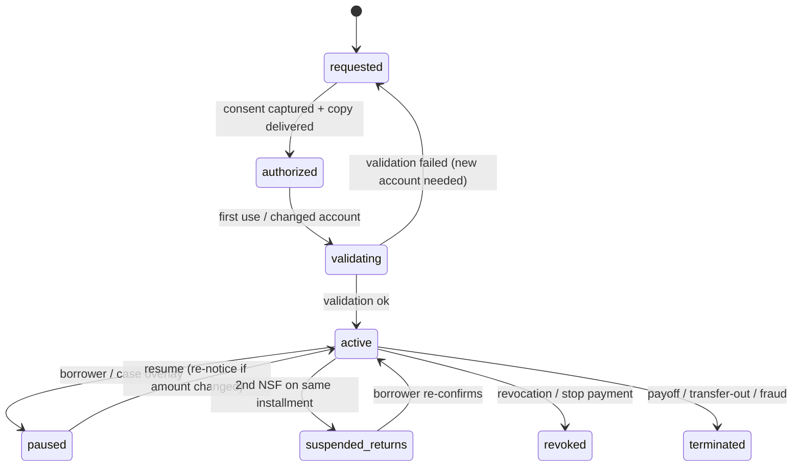

# 2.3 — Automatic draft (ACH) setup

| Attribute | Value |
|---|---|
| Section | 2 — Payment Processing & Cashiering |
| Automation class | a |
| SoR / Sub | Sub |
| Trigger & frequency | On borrower enrollment |
| Governing source | FNMA C-1.1-03 |
| Key deadlines | Per authorization |
| Timers | `FNMA_C1103_DRAFT_BY_PENALTY_FREE_DATE_GATE`, `NACHA_AUTH_RETENTION_2Y_POST_REVOCATION`, `NACHA_FRAUD_PROCEDURES_ANNUAL_REVIEW_365`, `NACHA_NSF_REINITIATION_180_MAX2`, `NACHA_PRENOTE_WAIT_3BANKING_DAYS`, `NACHA_R11_CORRECTED_REINITIATION_60`, `NACHA_RETURN_RATE_MONTHLY_WATCH`, `NACHA_WEB_ACCOUNT_VALIDATION_GATE`, `REGE_1005_10C_STOP_PAYMENT_3BD_GATE`, `REGE_1005_10C_WRITTEN_CONFIRMATION_14`, `REGE_1005_10D_VARIABLE_AMOUNT_NOTICE_10`, `SM_AUTODRAFT_COPY_DELIVERY_1BD` |

### Blueprint row
| Field | Value |
|---|---|
| Area | Cashiering |
| Trigger & frequency | On borrower enrollment |
| Governing source (blueprint) | FNMA C-1.1-03 |
| Key deadlines (blueprint) | Per authorization |
| Data/artifacts | ACH authorization |
| Systems | ACH network |
| Automation class (blueprint) | a |
| SoR / Sub | Sub |
| Nuances (blueprint) | (blank in source) |

### Verified requirement (as of 2026-09-09)

**Fannie Mae C-1.1-03, Automatically Drafting Payments from the Borrower's Bank Account (11/12/2014; Guide edition Aug. 12, 2026)** is a single sentence: "When automatically drafting a mortgage loan payment from a borrower's designated bank account, the servicer must draft each payment no later than the date the servicer would accept a mortgage loan payment by other payment methods without penalty." It says nothing about authorization form, fees, returns, notices or custodial handling. URL: https://servicing-guide.fanniemae.com/svc/c-1.1-03/automatically-drafting-payments-borrowers-bank-account (verified 2026-09-09). Deposits of drafted funds follow C-1.1-01 (24 hours) and A4-1-02/F-1-03 (6.1). A2-3-05 (11/08/2017) treats "accepting a 'phone pay' payment" as work outside the servicing fee (a fee is not prohibited by Fannie Mae), while prohibiting fees for "facilitating routine borrower collections" — URL: https://servicing-guide.fanniemae.com/svc/a2-3-05/fees-certain-servicing-activities (verified 2026-09-09).

**Regulation E, 12 CFR 1005.10 (eCFR current as of 2026-09-08).** (b): "Preauthorized electronic fund transfers from a consumer's account may be authorized only by a writing signed or similarly authenticated by the consumer"; the person obtaining the authorization "shall provide a copy to the consumer." (c): the consumer may stop payment by notifying the institution "orally or in writing at least three business days before the scheduled date"; institutions "may require the consumer to give written confirmation of a stop-payment order within 14 days of an oral notification." (d)(1): when a preauthorized transfer varies in amount, "the designated payee or the financial institution shall send the consumer written notice of the amount and date of the transfer at least 10 days before the scheduled date"; (d)(2): the consumer may elect notice "only when a transfer falls outside a specified range of amounts." (e)(1) compulsory use: "No financial institution or other person may condition an extension of credit to a consumer on the consumer's repayment by preauthorized electronic fund transfers." URL: https://www.ecfr.gov/current/title-12/chapter-X/part-1005/section-1005.10. Reg E therefore reaches Supermortgage as "designated payee"/"person obtaining the authorization" for consumer accounts; error resolution (1005.11) sits with the consumer's bank, whose R10/R11 returns arrive through Nacha.

**Nacha Operating Rules (via nacha.org rule pages, verified 2026-09-09).** *Meaningful Modernization (eff. Sept. 17, 2021):* consumer debit authorizations must be "readily identifiable" and in "clear and readily understandable terms"; minimum elements — amount or method of determining the amount, timing/frequency, account to be debited, date of authorization, consumer name, revocation instructions; "Standing Authorizations" with "Subsequent Entries" initiated by consumer action (TEL/WEB by initiation method); oral authorizations permitted over phone/internet; electronic signatures per E-SIGN; retain authorizations "for two years from the termination or revocation" and provide copies on request; WSUDs may be obtained electronically or orally (https://www.nacha.org/rules/meaningful-modernization). *WEB debit account validation (eff. Mar. 19, 2021):* a "commercially reasonable fraudulent transaction detection system" that includes account validation on "the first use of an account number, or changes to the account number" (prenote, micro-entries, validation services/APIs; NOC-updated numbers are validated by the RDFI's warranty) (https://www.nacha.org/rules/supplementing-fraud-detection-standards-web-debits). *Fraud Monitoring Phase 2 (eff. June 19, 2026; practical June 22):* all remaining non-consumer Originators, Third-Party Senders/Service Providers and ODFIs must "establish and implement risk-based processes and procedures reasonably intended to identify Entries suspected of being unauthorized or authorized under False Pretenses," reviewed "at least annually"; Phase 1 (Mar. 20, 2026) covered originators with ≥6 million 2023 entries (https://www.nacha.org/rules/risk-management-topics-fraud-monitoring-phase-2). *Company Entry Descriptions (eff. Mar. 20, 2026)* standardize "PAYROLL"/"PURCHASE" — not applicable to mortgage debits, but descriptions must be meaningful ("MORTGAGE PMT"). *Differentiating Unauthorized Return Reasons (2020–21):* R10 = "Customer Advises Originator is Not Known to Receiver and/or Originator is Not Authorized"; R11 = "Customer Advises Entry Not in Accordance with the Terms of the Authorization" — 60-day return window with a WSUD; after an R11 the Originator "may correct the error … and Transmit a new Entry … without the need for re-authorization … within 60 days from the Settlement Date of the Return Entry"; R11 counts toward the unauthorized return rate (https://www.nacha.org/rules/differentiating-unauthorized-return-reasons). *Network Risk and Enforcement (2015):* unauthorized return-rate threshold 0.5%, administrative (R02/R03/R04) 3.0%, overall 15.0%; reinitiated entries must carry "RETRY PYMT"; "an unauthorized debit cannot be remedied" by reinitiation (https://www.nacha.org/rules/ach-network-risk-and-enforcement-topics). Reinitiation limits for NSF/uncollected (R01/R09) — up to two reinitiations within 180 days of the original settlement date; R08 (stop payment) only with new authorization; prenote wait three banking days — **[PARTIALLY VERIFIED — Nacha Operating Rules §2.12.4/§2.6 as generally published; confirm in the 2026 Rules edition supplied by the ODFI]**. Return timing: R01/R02/R03/R04/R08/R09/R16/R20 within two banking days; R05/R07/R10/R11 within 60 calendar days (research/00b N10). Same-Day ACH per-entry limit $1,000,000 (00b).

**Card/"pay-to-pay" fees (task item).** The CFPB advisory opinion "Debt Collection Practices (Regulation F); Pay-to-Pay Fees" (87 FR 39733, July 5, 2022) was withdrawn effective May 12, 2025 (Federal Register doc 2025-08286, verified 2026-09-09) and does not appear on the CFPB's advisory-opinion list as of today (the only 2025 opinion is the Dec. 23, 2025 earned-wage-access opinion). What remains: FDCPA §808(1) (15 U.S.C. 1692f(1)) still bars a *debt collector* from collecting any amount "unless such amount is expressly authorized by the agreement creating the debt or permitted by law" — the withdrawn opinion was the Bureau's reading of that text, not the text itself; a subservicer that boards a loan already in default is a debt collector for that loan (11.4); Reg X 1024.35(b)(5) (fee without a reasonable basis) and UDAAP (Dodd-Frank §§1031/1036) apply to every loan; state statutes and AG positions vary **[UNVERIFIED — state-by-state convenience-fee rules not researched]**; Fannie Mae permits a "phone pay" fee (A2-3-05). Card-network rules generally restrict credit-card acceptance for mortgage principal payments **[UNVERIFIED — network rules are contract-gated]**. **Recommended platform policy:** no convenience fees on any channel (web, mobile, IVR, agent, ACH), no credit cards, debit cards only if a processor is contracted at Supermortgage's cost with no borrower fee — see Open question 2.3-Q4. Card rails are therefore disabled in v1 and the blueprint's "card rails" system entry is removed from scope pending that decision.

**Discrepancies with the blueprint row.** (a) C-1.1-03 imposes only the draft-timing rule; the substantive law is Reg E 1005.10 plus the Nacha Rules (contractual via the ODFI agreement), none of which the row cites. (b) "Per authorization" is not a deadline; the real clocks are: draft no later than the last penalty-free date (C-1.1-03), 10-day notice before a changed amount (1005.10(d)), 3-business-day stop-payment window (1005.10(c)), 2-year authorization retention after revocation, 60-day R11 correction window, 180-day/2-attempt NSF reinitiation limit, annual fraud-monitoring review. (c) Automation class "a" is right, but enrollment by voice/chat must run through the AI-disclosure and TCPA consent flows and produce an auditable authorization record. (d) The row is silent on the Originator/Third-Party Sender question — resolved: Supermortgage is the Originator under its own ODFI agreement because the custodial accounts are Supermortgage-established (6.1).

### Operational prerequisites
- **ODFI origination agreement** (Supermortgage as Originator; SEC codes PPD/WEB/TEL debits, PPD/CCD credits; exposure limits; Same-Day ACH; return-rate reporting; NOC/return file delivery by SFTP; company IDs per custodial deposit account) — Supermortgage treasury; 4–8 weeks.
- **Account-validation vendor** (instant account verification API and micro-entry fallback) meeting the WEB rule — Supermortgage; 2–4 weeks; `nacha` adapter contract test.
- **Fraud-monitoring procedures** (risk-based, documented, reviewed annually; velocity, new-account, amount-anomaly and return-rate monitors) approved by the `officer` before the first origination — Supermortgage compliance (Nacha Phase 2 already effective).
- **Authorization templates** (web/mobile, IVR script, agent script, paper form) reviewed by counsel for Reg E 1005.10(b), Nacha minimum elements, E-SIGN consent (7.4) and state e-signature law; versioned in `consent_templates`.
- **Custodial P&I accounts** designated as ACH deposit targets per remittance type (6.1) and `ti` for escrow; debit-return sweep account arrangement with the bank.
- **Borrower portal/IVR/voice** enrollment flows with automation disclosure; TCPA consents for reminder SMS/voice (4.x/11.x).
- **Partner acknowledgement** of Supermortgage's Originator status and company names on borrowers' bank statements ("SUPERMORTGAGE MORTGAGE PMT") — contract.

### Build spec
#### Inputs and triggers
- Enrollment requests: `autodraft.enrollment.requested` from portal/mobile (WEB), IVR/agent (TEL), paper form/lockbox coupon (PPD), boarding (`transfer_in.autodraft.inherited` — 1.1/1.6: transferor authorizations are **not** carried over without re-authorization unless counsel confirms assignability; default: re-enroll).
- Changes: `autodraft.change.requested` (account, date, extra-principal amount), `loan_terms.activated` (payment amount change → variable-amount notice), `autodraft.revocation.received` (any channel), `autodraft.pause.requested`.
- Network events: `ach.file.acknowledged`, `ach.entry.settled`, `ach.return.received{code}`, `ach.noc.received{code, corrected_data}`, `ach.prenote.result`.
- Schedules: `autodraft.file.build` daily at 14:00 ET for entries settling T+1/T+2; `autodraft.notice.sweep` daily (10-day notices); `autodraft.validation.sweep` (prenote/micro-entry completions); `nacha.fraud_monitor.daily`; `nacha.return_rate.monthly`; annual `nacha.fraud_procedures.review`.
- Case overlays: bankruptcy filing (suspend drafting unless the plan/consent allows — 14.x), payoff, transfer-out, foreclosure referral (drafting continues only for reinstatement/plan amounts by case rule), death of borrower (`sii` case).

#### Data model
- `autodraft_enrollments` (new): `id`, `loan_id`, `borrower_id`, `status` (state machine below), `sec_code` ∈ {PPD, WEB, TEL}, `authorization_kind` ∈ {recurring, standing} (standing = borrower-initiated one-time debits under a standing authorization), `amount_rule` ∈ {full_periodic_payment, periodic_plus_fixed_extra, fixed_amount, half_payment_semimonthly, biweekly_half (2.5 in-house)}, `extra_principal_cents`, `draft_day_rule` ∈ {due_date, fixed_day (1–16), split_1_15, every_14_days}, `next_draft_on`, `bank_account_token` (vaulted; last4 + routing in clear), `account_type` ∈ {checking, savings}, `validation_status` ∈ {pending, validated_api, validated_prenote, validated_microentry, validated_history, validated_noc, failed}, `validated_at`, `consent_id` (→ `consents`), `authorization_document_id`, `authorization_copy_delivered_at`, `revocation_instructions_version`, `range_notice_election` (jsonb: lower/upper cents; null = notify every change), `created_via` (channel), `revoked_at`, `revocation_source`, `termination_reason`, `retention_until` (revoked_at + 2 years), `rule_set_version`.
- `consents` (baseline) rows with `kind='autodraft'`: `evidence` (signed PDF hash, click-stream record, call recording id + transcript hash, IVR DTMF log), `authenticated_by` ∈ {esign, credentialed_session, recorded_voice, wet_signature}, `terms_version`.
- `ach_entries` (new): `id`, `enrollment_id?`, `payment_id?`, `direction` ∈ {debit, credit}, `sec_code`, `amount_cents`, `effective_entry_date`, `settlement_date`, `company_entry_description` ("MORTGAGE PMT", "RETRY PYMT", "ACCTVERIFY", "REFUND"), `trace_number`, `file_id`, `status` ∈ {built, transmitted, acknowledged, settled, returned, noc_received, cancelled}, `return_code?`, `returned_at`, `reinitiation_of_entry_id?`, `reinitiation_count`, `idempotency_key`.
- `ach_files`: `id`, `file_id_modifier`, `built_at`, `transmitted_at`, `entry_count`, `total_debit_cents`, `total_credit_cents`, `ack_status`, `document_id` (Nacha file archived), `hash`.
- `ach_returns` / `ach_nocs`: parsed return/NOC records linked to entries with `action_taken`.
- `autodraft_notices`: `enrollment_id`, `kind` ∈ {enrollment_confirmation, variable_amount_10d, revocation_confirmation, return_notice, reinitiation_notice, suspension_notice}, `notice_id`, `due_by`, `sent_at`.
- `fraud_monitor_findings`: `entry_id?/enrollment_id?`, `rule`, `score`, `disposition`, `reviewer`, `at`.
Retention: enrollments/consents/authorization evidence `tpsc_2y_post_revocation` (new retention class = 2 years after termination/revocation, longer if `life_of_loan_plus_4y` applies to the payment records themselves); Nacha files `respa_5y` **[policy]**. PII: bank account numbers tokenized in the vault; never in logs or decision records.

#### State machine
`autodraft_enrollments.status`: `requested` → `authorized` (authorization captured with all Nacha/Reg E elements; copy delivered) → `validating` (WEB/TEL first use or changed account: API validation, else prenote/micro-entries) → `active` (validated; `next_draft_on` set) ⇄ `paused` (borrower request, forbearance/trial re-baselining, bankruptcy hold) → `revoked` (borrower revocation or Reg E stop) | `terminated` (payoff, transfer-out, loan liquidated, repeated returns per policy, fraud) | `suspended_returns` (two NSF returns on the same installment — needs borrower contact before re-activation). Terminal: `revoked`, `terminated`. Only the borrower (through any channel, logged as a `contacts` row) or a case rule can move to `paused`/`revoked`; the agent moves to `suspended_returns`/`terminated` per policy; `validating → active` only on a validation result.

#### Timers and gates
| Timer code | Kind | Trigger event | Anchor | Offset & unit | Satisfied by | Breach action |
|---|---|---|---|---|---|---|
| `FNMA_C1103_DRAFT_BY_PENALTY_FREE_DATE_GATE` | not_before_gate (upper bound) | `autodraft.entry.scheduled` | installment due date | settlement date must be ≤ due date + grace days (default 15) | file build validator | entry rejected; agent reschedules; sev-3 |
| `REGE_1005_10D_VARIABLE_AMOUNT_NOTICE_10` | deadline | `loan_terms.activated` affecting an active enrollment (or first draft of a new amount) | scheduled settlement date of the changed draft | −10 calendar days (notice must be **sent** by then) | `notice.sent` (or an in-range election covers it) | draft is held (not transmitted) unless the notice was sent; sev-2 |
| `REGE_1005_10C_STOP_PAYMENT_3BD_GATE` | gate | `autodraft.revocation.received` | scheduled settlement date | if received ≥ 3 business days before (Reg E 1005.2(d) "business day" = days the consumer's bank is open — proxied by the `federal` calendar excluding weekends), the entry must not be transmitted; if later, best efforts (pull from unsent file) | entry cancelled | transmitted-after-revocation → treat as unauthorized: immediate refund credit + `officer` notice |
| `NACHA_WEB_ACCOUNT_VALIDATION_GATE` | not_before_gate | `autodraft.enrollment.authorized{sec_code∈{WEB,TEL}}` or account change | — | `validation_status` ∈ validated_* | first live debit | file build refuses the entry |
| `NACHA_PRENOTE_WAIT_3BANKING_DAYS` | deadline (wait) | `ach.prenote.transmitted` | prenote settlement | 3 banking days **[PARTIALLY VERIFIED]** | no return → `validated_prenote` | R03/R04 → `validation failed` |
| `NACHA_R11_CORRECTED_REINITIATION_60` | deadline (window) | `ach.return.received{R11}` | return settlement date | 60 calendar days | corrected entry transmitted (or decision not to) | window closes; new authorization required |
| `NACHA_NSF_REINITIATION_180_MAX2` | gate (counter) | `ach.return.received{R01|R09}` | original settlement date | ≤ 2 reinitiations within 180 calendar days | — | 3rd attempt refused; enrollment → `suspended_returns` |
| `NACHA_AUTH_RETENTION_2Y_POST_REVOCATION` | retention | `autodraft.revoked`/`terminated` | revoked_at | 2 years | retention class applied | legal hold check before purge |
| `NACHA_FRAUD_PROCEDURES_ANNUAL_REVIEW_365` | recurring | policy adoption | last review | 365 calendar days | `policy.reviewed{nacha_fraud}` by `officer` | sev-2 compliance finding |
| `NACHA_RETURN_RATE_MONTHLY_WATCH` | recurring | month end | — | monthly | report produced | unauthorized > 0.5%, admin > 3%, overall > 15% (60-day look-back) → `officer` + ODFI notice |
| `SM_AUTODRAFT_COPY_DELIVERY_1BD` | deadline (Reg E "provide a copy") | `autodraft.enrollment.authorized` | authorized_at | 1 `business_days_servicer` | `notice.sent{enrollment_confirmation}` with the authorization text | sev-3 |
| `REGE_1005_10C_WRITTEN_CONFIRMATION_14` | optional window | oral revocation | revocation date | 14 calendar days (only if the platform elects to require written confirmation — default: **not required**) | — | — |

Jurisdiction overrides: `jurisdiction_rules.esign_autodraft_restrictions` (states requiring specific e-consent language) **[UNVERIFIED]**; none on timing.

#### Business rules and calculations
1. **Authorization content (Nacha + Reg E).** Every authorization (any channel) must capture and display: borrower name; loan number (masked); debited account (routing, account, type); amount rule and, for variable amounts, the statement that the amount will change with the payment and that notice will be sent ≥10 days before a changed debit (or the range election); timing/frequency and first debit date; date of authorization; company name as it will appear ("SUPERMORTGAGE"); revocation instructions (how, where, and that revocations received ≥ 3 business days before a scheduled debit stop that debit); the statement that enrollment is optional (Reg E 1005.10(e)(1)); E-SIGN consent for electronic delivery of the copy. Voice enrollments (TEL) are recorded with a scripted read-back and DTMF/verbal "yes"; the recording plus a written confirmation is the authorization evidence. A copy is delivered within 1 BD (`AUTODRAFT-CONFIRM-v1`).
2. **Account validation.** WEB/TEL first use and every account change: instant verification API first; fallback micro-entries (two credits, offsetting debit, description "ACCTVERIFY", borrower confirms amounts in the portal) or a $0 prenote (PPD) with a 3-banking-day wait; a NOC-corrected account is validated by the RDFI's warranty; prior successful debit history validates existing PPD accounts at boarding only if the authorization is re-executed.
3. **Draft scheduling.** `settlement_date` = the borrower's chosen day (1st–16th) or the due date; never later than `due_date + grace_days` (C-1.1-03); if the chosen day is a non-banking day, settle the **preceding** banking day when that would otherwise breach the gate, else the next banking day; the effective entry date is T−1/T−2; `received_on` for the resulting payment = settlement date (2.1 rule 1). Semimonthly/biweekly rules are in 2.5.
4. **Amount computation.** `amount = periodic payment P effective for the installment being paid + extra_principal_cents (+ outstanding late charge only if the borrower elected "include fees" in the authorization)`; trial-period and plan amounts come from the case (2.6/12.x) and require an explicit re-authorization or a variable-amount notice. Any change in the debited amount from the prior debit triggers rule 5.
5. **Variable-amount notice.** Send `AUTODRAFT-AMOUNT-CHANGE-v1` (amount and date of the next debit) so that it is sent ≥ 10 calendar days before the changed debit's scheduled date (Reg E 1005.10(d)(1)); the annual/short-year escrow statement (3.3) or ARM notice (7.2) satisfies this only if it states the exact new debit amount and date and is sent in time — the engine checks the notice registry and otherwise sends the dedicated notice. Borrowers may elect range notices ((d)(2)); default = notify on every change.
6. **Revocation.** Accepted through any channel (portal, IVR, agent, mail, email, bank-initiated stop) and logged as a `contacts` row; effective immediately for any unsent file; entries already transmitted are not reversible under Nacha reversal rules (reversals are for erroneous entries only) — if a debit settles after a timely revocation, refund by PPD credit the same day and record an `officer` notice. Written confirmation of oral revocations is **not** required (policy; Reg E permits requiring it within 14 days).
7. **Returns.** R01/R09: reverse the payment (2.1 rule 9), assess the NSF fee if permitted (2.7 rules), notify the borrower (`AUTODRAFT-RETURN-v1`), and reinitiate once automatically 3–5 banking days later with "RETRY PYMT" if the borrower has not paid otherwise and the loan is not on hold; at most two reinitiations within 180 days; a second return moves the enrollment to `suspended_returns` and hands to `borrower-comms`. R02/R03/R04/R20 (administrative): terminate the account on the enrollment, request a new account, no reinitiation. R05/R07/R10/R29: **unauthorized** — cancel the enrollment immediately, refund nothing further, open a `fraud` case if our records show a valid authorization (dispute with the RDFI through the ODFI with the authorization copy), never reinitiate. R11: correct and reinitiate within 60 days without new authorization if the defect is ours (wrong amount/date); otherwise treat as revoked. R08: stop payment — enrollment `paused`; a new authorization is required before any further debit. R16/R17 (frozen/fraud): terminate and escalate. NOC (C01–C06 etc.): update the vaulted account data within six banking days **[PARTIALLY VERIFIED]** and continue.
8. **Late charges and returns.** A returned autodraft means the installment was not paid; 2.7 assesses the late charge only if no good-funds payment is credited by the grace end (the reinitiation, if it settles by then, is on time). Returned-payment fee: `nsf_fees` per 2.7 rule 8.
9. **Fraud monitoring (Nacha Phase 2).** Risk-based rules run on every enrollment and file: new account + first debit > 2 × P; multiple loans enrolled on the same bank account; account changed within 7 days of an increased extra-principal amount; refunds requested to an account other than the debited one; return-rate anomalies; velocity of enrollments from one IP/phone. Findings → `fraud_monitor_findings`; high scores hold the entry for agent review; procedures reviewed annually by the `officer`.
10. **Compulsory use.** No product, rate, fee waiver or workout may be conditioned on ACH enrollment; the enrollment UI must state it is optional.
11. **Worked example E.** Fixture L-1 borrower enrolls 2026-09-20 on the portal (WEB): amount rule `full_periodic_payment`, draft day = due date (1st), extra principal 10,000¢. Validation via API succeeds 2026-09-20 → `active`, `next_draft_on` 2026-10-01 (Thursday — banking day). File built 2026-09-29 14:00 ET for effective 2026-10-01: entry 219,257 + 10,000 = **229,257¢**, description "MORTGAGE PMT". Settlement 2026-10-01 → `payment.received{received_on 2026-10-01}` → 2.1 applies the October installment (interest on 24,954,677¢: 24,954,677 × 0.065 ÷ 12 = 135,171.17 → 135,171¢; principal 158,017 − 135,171 = 22,846¢; escrow 61,240¢) and 2.4 applies the 10,000¢ curtailment → UPB 24,954,677 − 22,846 − 10,000 = **24,921,831¢**. On 2026-12-10 the escrow analysis (3.2) raises the escrow payment to 64,916¢ effective 2027-01-01 → new debit 158,017 + 64,916 + 10,000 = 232,933¢; the annual escrow statement mailed 2026-12-12 states "your automatic payment of $2,329.33 will be drafted on 01/01/2027" → satisfies the 10-day rule (deadline 2026-12-22). On 2027-02-01 the debit returns R01 on 2027-02-03: the February payment is reversed, NSF fee (if permitted) 2,500¢ posted, `AUTODRAFT-RETURN-v1` sent, retry scheduled 2027-02-08 ("RETRY PYMT", reinitiation 1 of 2); the retry settles 2027-02-08 → February installment credited as of 2027-02-08 (within the grace period ending 2027-02-16 → no late charge).

#### Integrations
| Counterparty | Direction | Interface | Notes |
|---|---|---|---|
| ODFI (`nacha` adapter) | out/in | Nacha-format files by SFTP/PGP (batch header/entry detail/addenda/control records), acknowledgements, return and NOC files; Same-Day windows per ODFI schedule **[bank-specific cut-offs — UNVERIFIED]** | Idempotency: file id modifier + trace numbers; duplicate-file detection by hash; failure: retransmit within the window, else next window and reschedule settlement (gate re-check) |
| Account-validation vendor | out | REST API (instant verification) | Fallback to micro-entries/prenote; results stored on the enrollment |
| Custodial bank (`custodial-bank`) | in | Settlement credits on the P&I/T&I accounts (BAI2/camt.053) | Ties ACH settlements to `custodial_deposits` (24-hour rule evidence) |
| Borrower portal / mobile / IVR / voice agent | in | Internal enrollment API with consent capture, E-SIGN flow, read-back scripts | AI disclosure at call start; human handoff on request |
| Print-mail / e-delivery | out | Confirmation, 10-day notices, return notices | Electronic only with `esign` consent; otherwise mail (10-day notices must be sent in time for mail transit — build lead = 10 days + 0, since "sent" is the test) |
| Fannie Mae | — | none (payments flow through 2.1 → 5.1) | Fannie Mae's own A/A auto-draft of the custodial account is 5.2/6.x |

#### Outputs and artifacts
- Notices: `AUTODRAFT-CONFIRM-v1` (copy of the authorization + terms; Reg E 1005.10(b); Nacha minimum elements checklist), `AUTODRAFT-AMOUNT-CHANGE-v1` (amount and date; Reg E 1005.10(d)(1); sent ≥10 days before), `AUTODRAFT-REVOKED-v1` (confirmation of revocation and next steps), `AUTODRAFT-RETURN-v1` (return reason, fee if any, retry date, alternatives), `AUTODRAFT-RETRY-v1` (optional advance notice of the reinitiation — sent with the return notice), `AUTODRAFT-SUSPENDED-v1`.
- Records: `autodraft_enrollments`, `consents{autodraft}` with evidence hashes, `ach_files` (archived Nacha files), `ach_entries`, `ach_returns`, `ach_nocs`, `fraud_monitor_findings`, return-rate reports; `loan_events`: `autodraft.enrolled`, `autodraft.validated`, `autodraft.entry.originated`, `autodraft.entry.settled`, `autodraft.entry.returned`, `autodraft.revoked`, `autodraft.terminated`, `autodraft.notice.sent`.
- Ledger: settlements post through 2.1; returns through the Reversal Engine; refunds Dr `suspense_unapplied`/Cr custodial cash.

#### AI agent design (AI-first)
`cashiering` agent (enrollment module) with `borrower-comms` for voice/chat enrollment. Tools: `autodraft.read/write`, `consent.capture`, `account_validation.verify`, `nacha.build_entry` (validated by the gates), `nacha.cancel_entry`, `notice.send`, `contacts.log`, `fraud_monitor.score`, `escalation.create`, `timer.*`. Decision record: `{enrollment_id, action ∈ {enroll, validate, schedule, notice, retry, suspend, revoke, terminate, refund}, inputs{amount, dates, return_code?, validation?}, rule_refs[], fraud_score?, rationale, confidence}`. Guardrails: cannot originate a debit without an `active` enrollment, a passed validation gate, and a satisfied 10-day-notice check; cannot reinitiate an unauthorized return; cannot exceed two NSF retries; cannot condition anything on enrollment; must disclose automation and offer a human at the start of every voice/chat enrollment; cannot read back full account numbers. Escalations: `human_agent` on request; `officer` for fraud findings ≥ high, any debit transmitted after a timely revocation, and return-rate threshold breaches; `attorney` never (bankruptcy overlays come from 14.x case rules). Human path when AI off: ops-console Enrollment Queue with the same validators; borrowers can self-serve on the portal regardless.

#### Edge cases and failure modes
- **Transfer-in**: inherited authorizations are not used; borrowers are invited to re-enroll in the hello notice (1.3); if the transferor drafted after cutover, 1024.33(c) forwarding applies.
- **Transfer-out**: enrollments `terminated` at cutover; final debit not later than the last pre-cutover due date; borrower told in the goodbye notice (17.2).
- **Bankruptcy**: automatic stay → `paused` unless debtor's counsel/plan authorizes (14.x); post-discharge debits only with a fresh authorization.
- **SCRA / forbearance / trial**: amount re-baselined by the case; notice or re-authorization before the first changed debit; forbearance with suspended payments → `paused`.
- **Death of borrower / successor**: authorization terminates on notice of death (`sii` case); successor enrolls anew.
- **Duplicate enrollment** (two accounts active): only one recurring enrollment per loan; a standing authorization for one-time payments may coexist.
- **Bank outage / missed file window**: entries re-dated to the next window; if that breaches the penalty-free gate, the payment is credited as of the originally scheduled date by policy (borrower not penalized for our failure) and the decision logged.
- **Same-day duplicate debit** (our error): reversal entry under Nacha reversal rules within 5 banking days **[PARTIALLY VERIFIED]** plus refund credit; Reg E unauthorized-EFT exposure noted.
- **Account validation fails repeatedly**: enrollment stays `requested`; borrower notified; no debit.
- **NOC storms / bank mergers**: bulk routing-number updates applied from NOCs; no re-validation needed (RDFI warranty).
- **Payoff in flight**: enrollment `terminated` at payoff quote acceptance; final draft cancelled if the payoff funds arrive first (16.x).

#### Test cases and acceptance criteria
| ID | Given / When / Then |
|---|---|
| 2.3-T1 | Given a WEB enrollment, when authorization is captured, then all Nacha/Reg E elements are present (checklist), a copy notice is sent within 1 BD, and no debit is possible until `validation_status` is validated. |
| 2.3-T2 | Given a borrower-chosen draft day of the 20th, when scheduling, then the validator rejects it (grace end = 16th) and offers ≤ 16th. |
| 2.3-T3 | Given an escrow analysis changing P effective 2027-01-01, when no notice has been sent by 2026-12-22, then the 2027-01-01 entry is held and a sev-2 escalation is raised; when the annual statement carrying amount and date was sent 2026-12-12, the entry is released. |
| 2.3-T4 | Given a revocation received 2 business days before settlement with the file already transmitted, when the debit settles, then a same-day PPD refund is originated and `officer` is notified. |
| 2.3-T5 | Given an R01 return, when processed, then the payment is reversed, the fee (if permitted) posted, notice sent, and one retry scheduled with "RETRY PYMT"; a third attempt within 180 days is refused. |
| 2.3-T6 | Given an R10 return, when processed, then the enrollment is cancelled, no reinitiation occurs, and a fraud case opens if a valid authorization exists. |
| 2.3-T7 | Given an R11 return for a wrong amount, when corrected within 60 days, then the corrected entry is transmitted without new authorization; on day 61 the engine refuses. |
| 2.3-T8 | Given the 60-day unauthorized return rate reaches 0.6%, when the monthly watch runs, then `officer` and the ODFI are notified and enrollments from the affected channel are held for review. |
| 2.3-T9 | Given the retry in example E settles 2027-02-08, when 2.7 evaluates February, then no late charge is assessed. |
| 2.3-T10 | Given a voice enrollment, when the call starts, then the AI disclosure is logged before any account data is requested, and the recording + written confirmation are linked to the consent. |
| 2.3-T11 | Given a loan transferred out, when cutover completes, then the enrollment is `terminated` and no file after cutover contains the loan. |

#### Audit and evidence
Authorization evidence (documents, recordings, click-streams with hashes), `consents` rows, validation results, every Nacha file and acknowledgement, entry-level trace numbers, return/NOC records with dispositions, notices with proof of sending (10-day notice timing computed and stored), revocation `contacts` rows, fraud-monitoring findings and the annual procedure review sign-off, monthly return-rate reports. Produces the Nacha proof-of-authorization package on ODFI request within the required window (2 years post-revocation retention).

### Open questions / decisions
1. **Originator vs Third-Party Sender** — default: Supermortgage is the Originator under its own ODFI agreement (custodial accounts are Supermortgage-established per 6.1); confirm in the partner agreement and ODFI onboarding.
2. **Automatic NSF retry** — default: one automatic retry after 3–5 banking days, second only after borrower contact; never a third.
3. **Written confirmation of oral revocations** — default: not required.
4. **Convenience fees and cards** — default: no convenience fees on any channel; no credit cards; debit cards deferred; revisit only with counsel's state-by-state analysis (FDCPA §808(1) for default-boarded loans; UDAAP; A2-3-05 permits a phone-pay fee but Fannie Mae's permission is not a safe harbor).
5. **Inherited authorizations at transfer-in** — default: re-enroll everyone (no reliance on transferor authorizations).
6. **Range-notice election** — default: offered on the portal; if elected, range = ±$50 **[policy]**.

### Sources
- C-1.1-03 (11/12/2014): https://servicing-guide.fanniemae.com/svc/c-1.1-03/automatically-drafting-payments-borrowers-bank-account (verified 2026-09-09); A2-3-05 (11/08/2017): https://servicing-guide.fanniemae.com/svc/a2-3-05/fees-certain-servicing-activities
- 12 CFR 1005.10 (eCFR current as of 2026-09-08): https://www.ecfr.gov/current/title-12/chapter-X/part-1005/section-1005.10
- Nacha: Meaningful Modernization https://www.nacha.org/rules/meaningful-modernization ; WEB debit validation https://www.nacha.org/rules/supplementing-fraud-detection-standards-web-debits ; Fraud Monitoring Phase 2 https://www.nacha.org/rules/risk-management-topics-fraud-monitoring-phase-2 ; Rules index https://www.nacha.org/rules ; Differentiating Unauthorized Return Reasons https://www.nacha.org/rules/differentiating-unauthorized-return-reasons ; Network Risk and Enforcement Topics https://www.nacha.org/rules/ach-network-risk-and-enforcement-topics (all verified 2026-09-09)
- CFPB guidance withdrawal (90 FR, May 12, 2025, doc 2025-08286): https://www.federalregister.gov/documents/2025/05/12/2025-08286/interpretive-rules-policy-statements-and-advisory-opinions-withdrawal ; CFPB advisory opinion program page: https://www.consumerfinance.gov/compliance/advisory-opinion-program/ (verified 2026-09-09)
- research/00b-integration-landscape.md N10 (return codes, TPS analysis)
