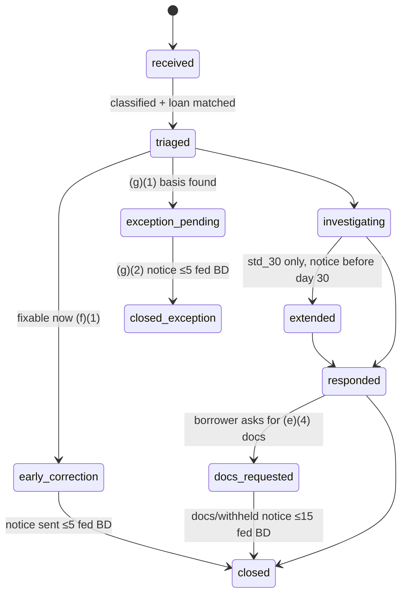

# 4.1 — Notice of Error (NoE) resolution

| Attribute | Value |
|---|---|
| Section | 4 — Customer Service & Borrower Communications |
| Automation class | b |
| SoR / Sub | Sub |
| Trigger & frequency | On borrower NoE (any written assertion of error; ~event-driven, continuous) |
| Governing source | Reg X 1024.35 |
| Key deadlines | Acknowledge ≤5 business days; respond ≤30 BD (+15 ext.); payoff-balance errors (1024.35(b)(6)) ≤7 BD; foreclosure errors before sale; no extension for (b)(6)/(9)/(10) |
| Timers | `NY_419_6_NOE_EXTENSION_7BD`, `NY_419_6_NOE_FC_RESPONSE_15BD`, `REGX_1024_35D_NOE_ACK_5`, `REGX_1024_35E4_NOE_DOCS_15`, `REGX_1024_35E_FC_NOE_OPEN`, `REGX_1024_35E_NOE_EXT_NOTICE_BEFORE_30`, `REGX_1024_35E_NOE_FC_RESPONSE_SALE_OR_30`, `REGX_1024_35E_NOE_PAYOFF_RESPONSE_7`, `REGX_1024_35E_NOE_RESPONSE_30`, `REGX_1024_35F1_NOE_EARLY_CORRECTION_5`, `REGX_1024_35F2_FC_GOODFAITH_RESPONSE`, `REGX_1024_35G2_NOE_EXCEPTION_NOTICE_5`, `REGX_1024_35I_CREDIT_SUPPRESS_60`, `SM_NOE_INTERNAL_TARGET_10` |

### Blueprint row
| Field | Value |
|---|---|
| Area | Customer Service |
| Trigger & frequency | On borrower NoE (any written assertion of error; ~event-driven, continuous) |
| Governing source (blueprint) | Reg X 1024.35 |
| Key deadlines (blueprint) | Acknowledge ≤5 business days; respond ≤30 BD (+15 ext.); payoff-balance errors (1024.35(b)(6)) ≤7 BD; foreclosure errors before sale; no extension for (b)(6)/(9)/(10) |
| Data/artifacts | Error log; retain |
| Systems | Case mgmt |
| Automation class (blueprint) | b |
| SoR / Sub | Sub |
| Nuances (blueprint) | (blank in source) |

### Verified requirement (as of 2026-09-09)

**Source verified:** 12 CFR 1024.35 on eCFR, "current as of September 4, 2026," last amended 81 FR 72371 (Oct. 19, 2016); Supplement I comments 35(a)-1 through 35(h)-1; RESPA §6(e), (f), (k) (12 U.S.C. 2605). No 2025–2026 amendment exists (00a §1.3).

**Scope (§1024.35(a)).** The section applies to "any written notice from the borrower that asserts an error and that includes the name of the borrower, information that enables the servicer to identify the borrower's mortgage loan account, and the error the borrower believes has occurred." A notice on a payment coupon or other payment medium supplied by the servicer is not an NoE. A qualified written request (QWR) that asserts a servicing error is an NoE. Per comment 35(a)-1 a notice from the borrower's agent is the borrower's notice (the servicer may require documentation of authority, then must treat it as submitted); per comment 35(a)-2 the servicer may not rely on the borrower's label — a letter styled "Notice of Error" that asks for escrow statements is evaluated on substance and may be both an NoE and an RFI. No oral NoE exists, but §1024.38(b)(5) / comment 38(b)(5)-2 require policies that tell dissatisfied oral complainants how to use the written §§1024.35/.36 procedures.

**Covered errors (§1024.35(b)(1)–(11)):** (1) failure to accept a conforming payment; (2) failure to apply an accepted payment to principal, interest, escrow or other charges under the loan terms and applicable law; (3) failure to credit a payment as of the date of receipt (12 CFR 1026.36(c)(1)); (4) failure to pay taxes, insurance premiums or other charges timely as required by §1024.34(a); (5) imposition of a fee or charge the servicer "lacks a reasonable basis to impose" (comment 35(b)-2 examples: late fee on a payment that was not late, charge for a service not rendered, default property-management fees not justified, force-placed insurance charges not permitted by §1024.37); (6) failure to provide an accurate payoff balance on request (1026.36(c)(3)); (7) failure to provide accurate loss-mitigation/foreclosure information required by §1024.39; (8) failure to transfer accurately and timely servicing information to a transferee servicer; (9) making the first foreclosure notice or filing in violation of §1024.41(f) or (j); (10) moving for foreclosure judgment/order of sale or conducting a sale in violation of §1024.41(g) or (j); (11) "any other error relating to the servicing of a borrower's mortgage loan." Comment 35(b)-1 excludes origination, underwriting, subsequent sale/securitization, and the decision to transfer servicing (but not the accuracy/timeliness of the transfer itself).

**Exclusive address (§1024.35(c); comments 35(c)-1 to -4).** A servicer *may* designate by written notice an address the borrower *must* use; the notice must state that the borrower must use it; the same address must be designated for RFIs (§1024.36(b)); written notice is required before any change; the address must be posted on any website that lists a contact address. Comment 35(c)-2: the address must also appear on any periodic statement or coupon book, and on any §1024.39 or §1024.41 notice that includes contact information. Comment 35(c)-3: multiple offices are permitted and a notice received at any designated office must be honored. Comment 35(c)-4: an online intake (email/web form) may be established "in addition to, and not in lieu of" mail and becomes the exclusive online channel without a separate notice. If no exclusive address is designated, notices received at any office count (comment 35(c)-1). Comment 38(b)(5)-3: notices misdirected to loss-mitigation or continuity-of-contact addresses must be redirected or the borrower told the correct procedure.

**Clocks — all counted in "days (excluding legal public holidays, Saturdays, and Sundays)"** — *not* Reg X §1024.2(b) "business days" (a discrepancy with the blueprint row's "business days"; the practical difference is that a day Supermortgage is closed but the federal government is not still counts):
- Acknowledgment (§1024.35(d)): written acknowledgment within **5** days.
- Response (§1024.35(e)(3)(i)): (A) **7** days for (b)(6) payoff errors; (B) for (b)(9)/(10), "prior to the date of a foreclosure sale or within 30 days," whichever is earlier; (C) **30** days for everything else.
- Extension (§1024.35(e)(3)(ii)): **+15** days for (C)-category errors only, if the servicer notifies the borrower in writing of the extension and its reasons *before the original 30 days end*; "may not extend" for (b)(6), (9), (10). Comment 35(e)(3)(ii)-1: a multi-error notice may be split so each error gets its own permissible extension.
- Documents (§1024.35(e)(4)): copies of the documents "relied upon" to determine no error, at no charge, within **15** days of the borrower's request; confidential/proprietary/privileged material may be withheld with written notice within the same 15 days. Comment 35(e)(4)-1: e.g., screen captures of the collection system showing the credited amounts.
- Early correction (§1024.35(f)(1)): if the servicer corrects the error(s) and notifies the borrower in writing within **5** days, (d) and (e) do not apply. §1024.35(f)(2): for (b)(9)/(10) errors received **7 or fewer days before a foreclosure sale**, the servicer "shall make a good faith attempt to respond to the borrower, orally or in writing," and either correct or state that no error occurred; (d) and (e) do not apply.
- Exceptions (§1024.35(g)): no duty under (d)/(e) if the servicer "reasonably determines" the notice is (i) **duplicative** (substantially the same error already answered, unless "new and material information" — information not previously reviewed and reasonably likely to change the determination; comment 35(g)(1)(i)-1: arguing about whether information was reviewed is not new information), (ii) **overbroad** (servicer "cannot reasonably determine ... the specific error"; comment 35(g)(1)(ii)-1 examples: everything-about-the-loan assertions, pleading-style numbered paragraphs, unintelligible voluminous submissions; *but* any valid error that can reasonably be identified inside an overbroad notice must be handled), or (iii) **untimely** (delivered more than **1 year** after servicing transferred to a transferee or the loan was discharged). The (g)(2) notice stating the basis is due within **5** days of the determination.
- Fees (§1024.35(h)): no fee and no payment may be required as a condition of responding (comment 35(h)-1: the borrower still owes the payments).
- Credit reporting (§1024.35(i)(1)): for **60** (calendar) days after receipt, no adverse information may be furnished to any consumer reporting agency "regarding any payment that is the subject of the notice of error." §1024.35(i)(2): other remedies, including foreclosure, are not restricted except as provided for (b)(9)/(10) assertions. Comment 35(e)(3)(i)-1: a servicer that cannot respond before the sale "may cancel or postpone" the sale and respond before the rescheduled sale.

**Response content (§1024.35(e)(1)).** Either (A) correct the error and notify in writing of "the correction, the effective date of the correction, and contact information, including a telephone number, for further assistance," or (B) after "a reasonable investigation" notify in writing that "no error occurred," with "a statement of the reason or reasons," the borrower's right to request the documents relied upon, how to request them, and contact information with a telephone number. (e)(1)(ii): additional/different errors found must be corrected and described (errors, action taken, effective date, contact info). (e)(2): the servicer may ask the borrower for supporting documents but cannot make them a condition of investigating or find "no error" merely because the borrower did not supply them. Comments 35(e)(1)(i)-1 and (ii)-1: one or several response letters are both acceptable.

**Statute overlay.** RESPA §6(e)(1)–(4) (QWR: 5-day acknowledgment, 30-day action, 15-day extension, 60-day credit-rating protection) and §6(k)(1)(C) ("fail to take timely action to respond to a borrower's requests to correct errors relating to allocation of payments, final balances for purposes of paying off the loan, or avoiding foreclosure, or other standard servicer's duties") are the statutory hooks; §6(f) damages as stated in the overview.

**Fannie Mae layer.** A4-1-03 (12/20/2023): the servicer "must promptly respond to all inquiries, especially in the event of a borrower dispute," must have processes to resolve servicer-error allegations "in accordance with applicable law," must not impose unnecessary fees during resolution, and before commencing foreclosure during an ongoing dispute must "conduct a thorough review" and make "reasonable efforts to resolve the dispute." A2-1-01 (12/17/2025): "effective processes to promptly address borrower inquiries." A4-2.1-04 (12/16/2015): email responses within 48 hours (a customer-service metric, not a Reg X clock).

**State overlay (design as `jurisdiction_rules`).** New York 3 NYCRR 419.6 (current through June 25, 2025): written acknowledgment within 5 business days; payoff disputes 7 business days; foreclosure-related complaints before sale or within **15 business days**, whichever is earlier; other complaints 30 business days; extension **7 business days** (30-day category only); supporting documents within 15 business days; mandatory disclosure of the complaint address, toll-free number, DFS registration and the DFS Consumer Assistance Unit number (1-800-342-3736) on welcome packets, statements and websites. Other states' complaint-response rules exist and must be loaded state by state **[UNVERIFIED — not enumerated here]**.

**Discrepancies vs. blueprint row.** (1) Day counting is "days excluding legal public holidays, Saturdays and Sundays," not servicer business days. (2) The (b)(9)/(10) deadline is the *earlier* of the sale date and 30 days, with a distinct (f)(2) good-faith rule for ≤7 days before sale. (3) The row omits the 5-day (g)(2) exception notice, the 15-day document-copy duty, the 5-day early-correction alternative, the 60-day credit-reporting bar and the fee prohibition — all hard requirements below. (4) Automation class "b" is upgraded to AI-first with policy-configured (not legally required) human review.

### Operational prerequisites
- **Exclusive NoE/RFI address** (Supermortgage; 4–6 weeks): a dedicated P.O. Box (or vendor mail-scanning lockbox address) plus an exclusive online intake (secure message center + web form). Artifact: `designated_addresses` row; written designation notice (template `NTC_REGX_35C_ADDRESS`) delivered with the RESPA hello notice (1.3) or as a standalone mailing for boarded loans; website footer publication; periodic statement template update (7.1); all §1024.39/.41 templates (11.2, 12.x) carry it. Partner co-signs the notice text because the partner's name may appear as servicer of record.
- **Mail scanning/OCR vendor** (Supermortgage; 6–10 weeks): same-day scan of all inbound mail to the designated and general addresses, receipt-date stamping, image + OCR text delivery via SFTP/API [vendor-specific, UNVERIFIED specs]. Receipt date = vendor receipt date at the P.O. Box, evidenced by the vendor's daily manifest.
- **Print/mail and e-delivery vendor** (00b N9) with proof-of-mailing evidence per piece; E-SIGN consent class `regx_correspondence` in `consents` (7.4) for electronic acknowledgments/responses.
- **Federal holiday calendar** loaded in `holiday_calendars` (`federal`, 5 U.S.C. 6103(a) dates), maintained annually by `compliance-sentinel`.
- **Prior-servicer records access** for transferred loans (Section 1.x): transfer file (payment history, notes, prior NoE log) boarded; contractual cooperation clause with transferors (comment 38(b)(4)); an RFI-to-transferor procedure with a 10-business-day internal SLA.
- **Credit-reporting suppression hook** (Section 8.1) supporting per-payment/per-period adverse suppression with an end date.
- **Foreclosure gate wiring** (13.1–13.3): the foreclosure-ops agent and attorney network must consume `REGX_1024_35E_FC_NOE_OPEN` gates.
- **NY registration** (Sub; 3 NYCRR Part 418) and the 419.6 disclosure text; `jurisdiction_rules` seeded for NY and any other verified state rule.
- **AI governance artifacts** (LL-2026-04): `case` and `borrower-comms` agents entered in the model/agent inventory with pre-deployment evaluation suites (classification recall on NoE/RFI/complaint corpora; determination accuracy on seeded ledger errors).

### Build spec
#### Inputs and triggers
- `communication.inbound.received` (from the Intake Router; payload: channel ∈ {mail, fax, email, web_form, secure_message, chat_transcript, voice_transcript, sms, regulator_portal, cfpb_portal, attorney}, `received_at`, `received_address_id`, document/transcript ids, sender identity assertions).
- `communication.classified` → `case.noe.opened` when the classifier finds a *written* assertion of error (chat/secure-message/email/web-form text is "written"; voice transcripts are not — a voice complaint creates a `complaint` case and triggers the §1024.38(b)(5) oral-complaint script, see 4.5).
- `case.noe.borrower_document.received` (borrower supplies information; §1024.35(e)(2)).
- `case.noe.document_copies.requested` (§1024.35(e)(4) request; may be oral or written — design honors both).
- `foreclosure.sale.scheduled` / `foreclosure.sale.rescheduled` (recomputes (b)(9)/(10) due dates).
- `loan.servicing.transferred_in` with `prior_servicer_noe_log` (duplicate detection, one-year clock).
- `timer.warning` / `timer.breached` from the Timer Engine.

#### Data model
New tables (snake_case; retention class `regx_1y_post_transfer` minimum, elevated to `life_of_loan_plus_4y` per A2-1-01 because Fannie Mae may request dispute files; PII columns encrypted):
- `designated_addresses` — `id`, `kind` ∈ {noe_rfi_exclusive, online_exclusive, lossmit, continuity, general, payment}, `lines` jsonb, `channel` ∈ {mail, web_form, secure_message, email}, `effective_from` date, `effective_to` date, `designation_notice_template_version`, `published_on` jsonb {website: bool, statements: bool, ei_notices: bool}. Constraint: at most one active `noe_rfi_exclusive` per servicer entity; changing it requires a `notice` of type `NTC_REGX_35C_ADDRESS_CHANGE` sent to all active loans before `effective_from`.
- `inbound_communications` — `id`, `loan_id` nullable (unmatched mail), `party_id`, `channel`, `received_at timestamptz`, `receipt_date date` (in `America/New_York`; for mail = vendor receipt date), `received_address_id`, `document_id`, `text` (OCR/transcript), `language_detected`, `classifier_run_id`, `classifications` jsonb [{kind, confidence, spans}], `routed_case_ids uuid[]`, `status` ∈ {new, routed, no_action, needs_human}.
- `cases` (baseline) — used with `case_type='noe'`; section-specific columns: `received_at`, `receipt_date`, `received_via`, `received_at_exclusive_address bool`, `is_qwr bool`, `submitted_by_agent bool`, `agent_authorization_status` ∈ {n/a, pending, verified, refused}, `foreclosure_sale_date_at_receipt date`, `deadline_profile` ∈ {std_30, payoff_7, foreclosure_sale_or_30, fc_within_7_days_goodfaith, early_correction_5}, `extension_used bool`, `exception_basis` ∈ {none, duplicative, overbroad, untimely_transfer, untimely_discharge}, `determination` ∈ {corrected, no_error, additional_errors_corrected, exception, early_corrected, partial_exception}, `human_review_reason text[]`, `closed_at`, `jurisdiction_profile` (e.g., `NY_419_6`).
- `case_assertions` — `id`, `case_id`, `seq`, `category` ∈ {b1,…,b11}, `description`, `period_start`, `period_end`, `amount_asserted_cents bigint`, `investigation jsonb` (tool calls, records examined, findings), `determination` ∈ {error_found, no_error, cannot_determine_needs_borrower_info, out_of_scope, duplicative, overbroad}, `correction_commands uuid[]`, `ledger_entry_ids bigint[]`, `effective_date_of_correction date`, `response_notice_id`.
- `case_relied_documents` — `case_id`, `assertion_id`, `document_id` or `system_snapshot_id`, `relied_upon bool`, `withheld_reason` ∈ {null, confidential, proprietary, privileged}. Every "no error" determination must have ≥1 row.
- `system_snapshots` — immutable rendered captures (PDF + JSON) of ledger/payment-history/escrow screens at investigation time (comment 35(e)(4)-1), SHA-256 in `documents`.
- `document_copy_requests` — `case_id`, `requested_at`, `requested_via`, `due_at`, `fulfilled_notice_id`, `withheld_notice_id`.
- `credit_reporting_suppressions` — `loan_id`, `case_id`, `scope jsonb` (payment due dates / periods named in the NoE, or `all` when the NoE disputes the delinquency as a whole), `starts_at` (receipt date), `ends_at` (receipt + 60 calendar days), `reason='regx_1024_35_i'`. **Minimal shape only — the §1024.35(i) NoE case is the single reason 4.1 writes. 8.3 owns the full schema** (adding `borrower_id`, `mechanism`, seven further `reason` values and the suppression state machine); build against 8.3's definition and treat this as the 4.1 slice of it. Consumed by 8.1 before every Metro 2 cycle and by 8.2.
- `timer_definitions` gain a unit value `business_days_federal` (calendar `federal`): all days except Saturdays, Sundays and the *statutory* dates of the 11 legal public holidays in 5 U.S.C. 6103(a) (observed substitutes are **counted** as days — conservative, following the logic of Reg Z comment 2(a)(6)-2; open decision 4.1-Q2).

#### State machine
`received → triaged → (exception_pending | investigating | early_correction) → (extended)? → responded → (docs_requested → docs_provided)? → closed`; terminal: `closed`, `closed_exception`, `withdrawn`. Guards: `triaged` requires classifier output + agent-authorization check; `investigating → responded` requires every `case_assertions.determination` set and, for `no_error`, ≥1 `case_relied_documents` row and a `statement_of_reasons`; `extended` allowed only if `deadline_profile='std_30'`, no prior extension, and `now < original_due_at`; `exception_pending → closed_exception` requires the (g)(2) notice sent ≤5 federal BD after the exception determination; `closed` requires all response notices to have delivery evidence. Actors: `case` agent (all transitions), `human_agent`/`officer`/`attorney` where policy review is configured, Timer Engine (breach flags, never transitions), borrower (withdrawal via written notice only).

#### Timers and gates
| Timer code | Kind | Trigger event | Anchor | Offset & unit | Satisfied by | Breach action |
|---|---|---|---|---|---|---|
| `REGX_1024_35D_NOE_ACK_5` | deadline | `case.noe.opened` | receipt_date | 5 `business_days_federal` | `notice.sent` (template `NTC_REGX_35D_ACK`) or `case.noe.early_corrected` or `case.noe.exception_noticed` | escalate `officer` sev-2; auto-send ack anyway |
| `REGX_1024_35E_NOE_RESPONSE_30` | deadline | `case.noe.opened` with profile `std_30` | receipt_date | 30 `business_days_federal` (+15 on `case.noe.extended`) | `case.noe.responded` | escalate `officer` sev-1; daily sentinel report |
| `REGX_1024_35E_NOE_EXT_NOTICE_BEFORE_30` | not_before_gate (inverse: must-act-before) | `case.noe.opened` (`std_30`) | receipt_date | 30 `business_days_federal` | `notice.sent` (`NTC_REGX_35E_EXTENSION`) | extension refused by command if past due |
| `REGX_1024_35E_NOE_PAYOFF_RESPONSE_7` | deadline | `case.noe.opened` with any `b6` assertion | receipt_date | 7 `business_days_federal` | `case.noe.responded` for the b6 assertion | escalate `officer` sev-1 |
| `REGX_1024_35E_NOE_FC_RESPONSE_SALE_OR_30` | deadline | `case.noe.opened` with any `b9`/`b10` assertion | receipt_date | min(30 `business_days_federal`, `foreclosure_sale_date − 1 calendar day`) recomputed on `foreclosure.sale.rescheduled` | `case.noe.responded` | escalate `attorney` + `officer` sev-1; foreclosure-ops postpones sale (comment 35(e)(3)(i)-1) |
| `REGX_1024_35E_FC_NOE_OPEN` | not_before_gate | `case.noe.opened` (b9/b10) | — | until `case.noe.responded` | — | `foreclosure.sale.conduct` and `foreclosure.judgment.motion` commands call `assertGateOpen`; block + attorney escalation |
| `REGX_1024_35F2_FC_GOODFAITH_RESPONSE` | deadline | `case.noe.opened` (b9/b10) received ≤7 calendar days before sale | receipt_at | before sale date/time | `contact` with `mode` any + `case.noe.goodfaith_responded` | escalate `attorney` sev-1 immediately |
| `REGX_1024_35E4_NOE_DOCS_15` | deadline | `case.noe.document_copies.requested` | request date | 15 `business_days_federal` | `notice.sent` (`NTC_REGX_35E4_DOCS` or `NTC_REGX_35E4_WITHHELD`) | escalate `officer` sev-2 |
| `REGX_1024_35F1_NOE_EARLY_CORRECTION_5` | deadline (optional path) | `case.noe.early_correction.started` | receipt_date | 5 `business_days_federal` | `notice.sent` (`NTC_REGX_35F1_EARLY_CORRECTION`) | fall back to std path (ack + response timers remain live) |
| `REGX_1024_35G2_NOE_EXCEPTION_NOTICE_5` | deadline | `case.noe.exception_determined` | determination date | 5 `business_days_federal` | `notice.sent` (`NTC_REGX_35G2_EXCEPTION`) | escalate `officer` sev-2 |
| `REGX_1024_35I_CREDIT_SUPPRESS_60` | not_before_gate | `case.noe.opened` (any payment-related assertion) | receipt_date | 60 `calendar_days` | expiry | `metro2.furnish` command checks `credit_reporting_suppressions`; block adverse data for the scoped payments |
| `NY_419_6_NOE_FC_RESPONSE_15BD` | deadline (jurisdiction override, state NY) | as FC timer | receipt_date | min(15 `business_days_servicer`, sale − 1) | `case.noe.responded` | as FC timer |
| `NY_419_6_NOE_EXTENSION_7BD` | deadline override (NY) | `case.noe.extended` | original due | +7 `business_days_servicer` instead of +15 | `case.noe.responded` | escalate `officer` sev-1 |
| `SM_NOE_INTERNAL_TARGET_10` | deadline (policy) | `case.noe.opened` | receipt_date | 10 `business_days_federal` | `case.noe.responded` | warning only; drives queue priority |

Jurisdiction overrides come from `jurisdiction_rules.noe_response` (NY loaded; others **[UNVERIFIED]** until loaded). When both federal and state timers exist, the command layer enforces the earlier.

#### Business rules and calculations
1. **Receipt date.** Mail: vendor receipt date at the designated box (not postmark); electronic: `received_at` converted to `America/New_York` date. If received outside the exclusive address, policy default (4.1-Q1) is to honor it and start the clock at the earliest receipt anywhere in Supermortgage; the case records `received_at_exclusive_address=false` for litigation defense.
2. **Day counting.** Day 0 = receipt date; count forward skipping Saturdays, Sundays and 5 U.S.C. 6103(a) dates; due = the Nth counted day, end of day 23:59:59 ET. Worked example: NoE received Friday **2026-09-04**; Labor Day 2026-09-07 is excluded → acknowledgment due **2026-09-14**; 7-day payoff response due **2026-09-16**; 30-day response due **2026-10-20** (Columbus Day 2026-10-12 excluded); with a 15-day extension noticed on or before 2026-10-20, response due **2026-11-10** (Veterans Day 2026-11-11 is after the due date and does not matter); the 60-day credit-reporting bar runs through **2026-11-03**. A 15-day document-copy request received 2026-09-04 is due **2026-09-28**.
3. **Deadline profile selection** is per assertion, not per case: a single letter alleging a payoff error (b6) and a late-fee error (b5) yields two assertions with due dates 7 and 30 days; the response may be one letter by day 7 or two letters (comment 35(e)(1)(i)-1). Extension applies only to the b5 assertion (comment 35(e)(3)(ii)-1).
4. **Exception logic.** Duplicative: cosine/semantic match ≥0.85 against prior assertions on the same loan (including prior-servicer NoE log) **and** no new material information → `duplicative`; the agent must write why the new material is not "reasonably likely to change" the prior determination. Overbroad: applies only to the unidentifiable residue; any identifiable assertion is carved out and investigated. Untimely: receipt_date > (transfer_out_date or discharge_date) + 1 year; for transfer-*in* loans the clock refers to the *transferor's* transfer-out only if the error concerns the transferor — errors of Supermortgage's own servicing are never untimely on that basis.
5. **Investigation standard.** "Reasonable investigation" = examine the ledger, payment images, allocation rules (2.1), escrow analysis (3.2), fee schedule and `jurisdiction_rules` caps (2.7), notices sent (Notice Registry), contact logs, loss-mit case history, foreclosure milestones (DRA/attorney data), payoff quotes (16.1), and, for transferred loans, the boarding reconciliation (1.6) and prior-servicer records. Every consulted record is snapshotted. "No error" without consulting the record type the assertion implicates is a hard validation failure.
6. **Corrections** are ledger-neutral reversals plus re-postings with the original effective date (never edits), e.g., misapplied payment: reverse the original allocation, re-apply as of the receipt date, recompute interest/late charges, reverse any late charge lacking a basis, and cascade to escrow analysis if the escrow portion changed. Worked example (Fannie Mae uniform note, 5% late charge on P&I; state cap none): payment of **$1,842.17 P&I + $612.40 escrow = $2,454.57** received 2026-03-01 but posted 2026-03-17 → late charge assessed 5% × 184,217¢ = 9,210.85¢ → **9,211¢ ($92.11)** (round-half-up at the assessment step). Correction entries (cents): reverse `late_charges` −9,211 / `borrower_receivable` +9,211; re-date the payment application to 2026-03-01 (reverse and repost `principal`, `interest_due`, `escrow` legs with `effective_date=2026-03-01`); if interest was computed daily on a simple-interest ledger (not the case for a standard amortizing Fannie Mae loan, where scheduled interest is unaffected by intra-month posting), recompute; emit `payment.reapplied` and `fee.reversed` events, an investor `loan_data_change` only if UPB/LPI changed, and a Metro 2 correction (8.1) if the March payment was reported late.
7. **Response letter must contain** (checked by the template's required-content checklist): borrower name, loan identifier (masked), each assertion restated, determination per assertion, for corrections the action and effective date, for no-error the statement of reasons in plain language, the right to request relied-upon documents and how (address + online), a telephone number, the exclusive address block, and (NY) the DFS disclosure. Language: English, plus a translation in the borrower's preferred language when `borrowers.preferred_language` ≠ English and a reviewed template exists (voluntary; §1024.32(a)(3) permits non-English disclosures with English available on request).
8. **Fee prohibition (h)**: no fee code may post with reason `noe_response`; the case may not be held for "account current."
9. **Credit reporting**: on `case.noe.opened` with any assertion touching a payment (b1–b3, b5 late-fee disputes, b11 delinquency disputes), write a `credit_reporting_suppressions` row scoped to the disputed payment(s) for 60 calendar days; 8.1 furnishes no adverse status/rating for those payments in that window (mechanics — omit the account from the cycle, report prior status, or use the CRRG compliance-condition code — are decided in 8.1 **[UNVERIFIED which Metro 2 mechanism the 2026 CRRG prescribes]**).

#### Integrations
| Counterparty | Direction | Interface | Notes |
|---|---|---|---|
| Mail scanning/OCR vendor | in | SFTP/API daily batch + intraday pushes (image PDF, OCR text, receipt date, destination address) [vendor-specific, UNVERIFIED] | Idempotency: vendor piece id; missing-manifest alarm at 18:00 ET; outage → physical mail retrieved by staff and hand-scanned; receipt date = vendor log |
| Print/mail vendor (00b N9) | out | document-event contract (template id, payload, channel, consent status) | Returns mail-piece id + proof of mailing (IMb tracking) stored on `notices`; failure → retry, then alternate vendor; the timer is satisfied only on vendor acceptance evidence |
| E-delivery (secure message/email) | out | via `e-delivery` adapter with `esign` consent check | Bounce → automatic mail fallback within 1 business day; timer satisfied on mailing, not on the bounced email |
| Telephony/voice (Twilio + voice model) | in/out | `telephony/voice` adapter | Oral complaints and (f)(2) good-faith oral responses logged as `contacts`; recordings retained (comment 36(d)(1)(ii)-2 treats organized recordings as "available" information) |
| Ledger/escrow/fees/notices (internal) | read | typed tools (`ledger.query`, `payments.history`, `escrow.analysis.get`, `fees.list`, `notices.list`, `payoff.quotes.list`, `lossmit.case.get`, `foreclosure.case.get`) | Read-only; every call snapshotted to `system_snapshots` |
| Correction commands (internal) | write | `payment.reapply`, `fee.reverse`, `late_charge.waive`, `escrow.correct`, `suspense.apply`, `payoff.quote.reissue` | Each validates the case id; posts balanced ledger entries; emits events; investor reporting downstream (5.x) |
| Prior/transferor servicer | out/in | RFI letter/email per transfer agreement; MISMO transfer file lookup | 10-BD internal SLA; non-response documented as part of the reasonable investigation |
| Credit reporting (8.1/8.2) | out | suppression table | Metro 2 cycle reads suppressions |
| Foreclosure attorney network (13.x) | out | `attorney-network` adapter message `noe_hold` / `noe_cleared` | Sale postponement instruction when the FC timer cannot be met |
| Fannie Mae | none | — | No Fannie Mae submission is generated by an NoE; if the correction changes UPB/LPI/fees, the investor-reporting agent emits the normal events (5.x). A4-1-03 requires prompt response; MORA may sample dispute files |

#### Outputs and artifacts
Notices (all `notices` rows with template version, channel, evidence): `NTC_REGX_35C_ADDRESS` (exclusive address designation; §1024.35(c); checklist: statement that the borrower *must* use the address, same address for RFIs, online channel, website mention) and `NTC_REGX_35C_ADDRESS_CHANGE` (mailed before the change); `NTC_REGX_35D_ACK` (acknowledgment; identifies the assertions as understood, the applicable response date(s), the exclusive address, and — as a courtesy — what supporting documents would help, phrased as optional per §1024.35(e)(2)); `NTC_REGX_35E_CORRECTION`, `NTC_REGX_35E_NO_ERROR`, `NTC_REGX_35E_ADDITIONAL_ERRORS` (may be one combined letter); `NTC_REGX_35E_EXTENSION` (reasons required); `NTC_REGX_35E4_DOCS` / `NTC_REGX_35E4_WITHHELD`; `NTC_REGX_35F1_EARLY_CORRECTION`; `NTC_REGX_35G2_EXCEPTION` (basis stated: duplicative / overbroad / untimely; for overbroad also lists what was carved out and answered); `NTC_REGX_38B5_PROCEDURES` (the procedures explainer, also linked from statements per comment 38(b)(5)-1). Channel rule: electronic only with an unrevoked `esign` consent for class `regx_correspondence`; otherwise first-class mail to the borrower's mailing address (and to any confirmed successor/authorized agent of record). Records: `case_events` for every step, `agent_decisions` per determination, `system_snapshots`, `credit_reporting_suppressions`, the NoE log view (`v_noe_log`: receipt, categories, deadlines, dates met, determination, corrections, breach flags) for the partner, MORA and state exams.

#### AI agent design (AI-first)
- **Agents.** `borrower-comms` (channel handling, oral-complaint script, disclosure of automation at the start of every voice/chat session, warm transfer to `human_agent` on request) → Intake Router (a Claude classification call with tool use, system prompt bound to `rule_sets.regx.noe_rfi.2016`) → `case` agent (investigation, determination, corrections, response drafting) → `compliance-sentinel` (timers).
- **Intake Router contract.** Input: normalized text + metadata. Output (structured): `[{kind ∈ {noe, rfi, complaint, lossmit_request, sii_inquiry, payoff_request, cease_communication, attorney_representation, bankruptcy_notice, address_change, general_inquiry, other}, confidence, spans, loan_match_evidence}]`, `is_written`, `language`, `urgency` (foreclosure sale mentioned, disaster, death). Rules: a submission may carry several kinds (comment 35(a)-2); any assertion that something was done wrong on the account is `noe` even without the words "error" or "dispute"; any question about the account is `rfi`; loss-mit requests always also open a 12.1 intake; confidence < 0.6 or "other" → `needs_human` queue with a 1-servicer-BD SLA, and the ack timer still runs. Recall is the tuned metric (false positives cost a letter; false negatives cost a RESPA violation).
- **`case` agent, end-to-end.** Tools (allowlist): the read tools above, `documents.search`, `contacts.list`, `jurisdiction_rules.get`, `timer.list`, correction commands (each gated by `case_id` and per-command monetary thresholds), `notice.render_and_send`, `snapshot.capture`, `escalation.file`. Sequence: verify identity/authority → build assertions → compute deadline profile per assertion → check (g) exceptions → investigate each assertion with the required record types → decide → run corrections → draft response with citations to the records examined → self-check against the template checklist → send → set follow-ups. Decision record (`agent_decisions`): `{case_id, assertion_id, rule_set_version, model_version, prompt_version, records_examined[], findings, determination, reasons_plain_language, corrections[], amounts_cents, confidence, human_review_reason[], reviewer_id?, outcome}`.
- **Guardrails.** Cannot close a case without response evidence; cannot select `no_error` without snapshot rows; cannot select an exception on a case with an identifiable assertion; cannot extend (b)(6)/(9)/(10) profiles; cannot post corrections above `case.correction.max_cents` (default 500,000¢ = $5,000) or reverse a foreclosure milestone without human approval; must produce the plain-language reasons in ≤ grade-8 reading level (checked); never tells a borrower a fee is due as a condition of the investigation.
- **Human touchpoints.** Legally required: none for a standard NoE. Policy-configured (`case.human_review` flags, defaults on): (i) any (b)(9)/(10) assertion → `attorney` (foreclosure counsel of record) reviews the determination before it issues, because it may require postponing a sale or a court filing; (ii) corrections above the threshold, or any assertion alleging discrimination, UDAAP, or that is part of litigation/attorney representation → `officer` (compliance) approval; (iii) borrower asks for a person → `human_agent`; (iv) classifier `needs_human`. Escalation package: the draft response, decision record, snapshots, timer status, and a one-page summary. When `case.ai_path=off` for a loan or globally, the same tools are exposed to `human_agent` in the ops console and the AI drafts only.
- **Disclosure/consent.** Written responses do not require AI disclosure; voice/chat sessions do (baseline §8, state chatbot laws in 00a §5.6). Outbound AI voice to cell phones (e.g., an (f)(2) good-faith oral response) requires `tcpa_voice` consent or a human call.

#### Edge cases and failure modes
- **Transfer-in mid-case:** the NoE follows the loan; Supermortgage must respond on the original clock (§1024.35 duties run to "the servicer"; comment 38(b)(4)); boarding must ingest open NoE cases with their receipt dates (1.7 pattern). Transfer-out mid-case: respond before transfer if the deadline falls before the transfer date; otherwise hand off with the file and notify the borrower which servicer will answer; the one-year (g)(1)(iii) clock starts at the transfer date for errors of Supermortgage.
- **Foreclosure sale within 7 days:** (f)(2) good-faith oral/written response; log the `contact`; if the assertion is credible, foreclosure-ops postpones (Fannie Mae compensatory-fee timelines (13.5) recognize allowable delays only in listed cases — a postponement for NoE resolution may count against the timeline; document it).
- **Bankruptcy:** automatic stay does not suspend §1024.35; responses go to the borrower (and counsel if represented) with the bankruptcy disclaimer; coordinate with 14.x so corrections match the proof of claim/3002.1 notices.
- **FDCPA overlay (loan in default at transfer):** NoE responses are borrower-initiated communications; the CFPB's Oct. 2016 interpretive rule (81 FR 71977) on FDCPA safe harbors for Reg X compliance was not on the May 2025 withdrawal list **[PARTIALLY VERIFIED]**; a cease-communication request does not bar responding to the borrower's own NoE — counsel to confirm (11.4).
- **Successor in interest / agent:** an NoE from a *confirmed* successor is the borrower's (§1024.30(d)); from a *potential* successor it is handled as an RFI under §1024.36(i) (4.4) and the substantive error is investigated internally anyway; from an unverified agent, request authorization but start the clock (comment 35(a)-1) — the ack goes to the borrower.
- **Partial/unmatched data:** no loan match → 1 servicer-BD human resolution; the ack still goes out to the sender's return address with a request for identifying information; an NoE that identifies the account only by property address is sufficient.
- **Vendor outage:** mail scanning down → manual scan protocol; print vendor down → secondary vendor; e-delivery bounce → mail fallback. Timers never pause.
- **Ack reject/undeliverable:** returned mail triggers address research (skip trace) and a re-mail; the timer was satisfied by the original mailing evidence, but the case stays open until a deliverable address is used.
- **Retro-corrections:** if a correction is later found wrong, a new NoE-style case (`qc_finding`) is opened and a new response issued; never edit the original.
- **Duplicate channels:** the same letter arriving by web form and mail is one case (dedupe by text hash within 30 days), with the earliest receipt date.
- **NPRM switch-on:** `rule_sets.regx.lossmit.2024nprm` would make §1024.41 determinations (b)(7)/(b)(11) errors — the classifier and templates already treat "you denied me wrongly" as an NoE, so only the deadline wiring to appeals (12.3) changes.

#### Test cases and acceptance criteria
- **4.1-T1 (happy path):** Given a written letter received 2026-09-04 asserting a misapplied 2026-03-01 payment, when classified, then a `noe` case with assertion `b2` exists, ack mailed ≤2026-09-14, response by 2026-10-20, ledger shows reversal + repost dated 2026-03-01, late charge 9,211¢ reversed, suppression row through 2026-11-03.
- **4.1-T2 (holiday boundary):** Given receipt on 2026-11-06, then ack due 2026-11-16 (Veterans Day 11-11 excluded) and response due 2026-12-22; a servicer closure day (e.g., day after Thanksgiving) does not extend either date.
- **4.1-T3 (payoff error):** Given an assertion `b6`, then due 7 federal BD; extension command is rejected with `EXTENSION_NOT_PERMITTED`.
- **4.1-T4 (foreclosure error, sale in 20 days):** Given `b9` received 2026-09-04 with sale 2026-09-24, then due 2026-09-23; `foreclosure.sale.conduct` on 2026-09-24 is blocked while `REGX_1024_35E_FC_NOE_OPEN` is open; attorney escalation package generated; after response, the gate clears.
- **4.1-T5 (≤7 days before sale):** Given `b10` received 3 days before sale, then a good-faith contact is logged before the sale and the (f)(2) path records `deadline_profile=fc_within_7_days_goodfaith`; no ack timer.
- **4.1-T6 (extension):** Given `std_30` and an extension notice sent on the due date, then due moves +15 federal BD; an extension attempted one day after the due date is rejected.
- **4.1-T7 (overbroad with carve-out):** Given a 40-page pleading-style letter containing one identifiable late-fee assertion, then the late fee is investigated and answered and the (g)(2) notice states the overbroad basis for the remainder, both within their clocks.
- **4.1-T8 (duplicative):** Given the same escrow-shortage assertion answered 60 days ago and no new material, then `exception_basis=duplicative` and the (g)(2) notice issues ≤5 federal BD; with a new bank statement showing an unposted payment, the case is investigated.
- **4.1-T9 (untimely):** Given a discharge date 14 months before receipt, then untimely notice issues; given 11 months, investigated.
- **4.1-T10 (documents):** Given a no-error response and a borrower's oral request for documents, then copies (snapshots) are mailed ≤15 federal BD; a privileged memo is withheld with the written withholding notice in the same window.
- **4.1-T11 (early correction):** Given a clear posting error fixed on day 2 with the correction letter mailed on day 3, then ack/response timers cancel with reason `early_correction`.
- **4.1-T12 (NY override):** Given a NY property and a `b9` assertion with a sale in 40 days, then due = 15 servicer BD, not 30; extension for a `std_30` NY case adds 7 BD.
- **4.1-T13 (AI escalation):** Given classifier confidence 0.4, then `needs_human` queue with the ack timer running; a human classification within 1 BD does not change the receipt date.
- **4.1-T14 (mail vendor failure):** Given no manifest by 18:00 ET, then an alarm fires and the manual intake protocol logs receipt dates from the physical stamp.
- **4.1-T15 (fee prohibition):** Given a borrower 2 months delinquent, then no fee or payment is requested in any NoE communication (template checklist assertion).
- **4.1-T16 (transfer-in open case):** Given a boarding file with an NoE received by the transferor 20 federal BD earlier, then the case boards with the original receipt date and a 10-day residual clock.

#### Audit and evidence
Per case: immutable `case_events` timeline; the inbound image/OCR with vendor receipt evidence; classifier output and model/prompt versions; `agent_decisions` per assertion with records examined; `system_snapshots` hashes; correction ledger entries linked to `loan_events`; every notice with template version, checklist result, channel, consent id, mailing proof/IMb or e-delivery receipt; timer instances with due/satisfied/breached history; escalations and reviewer identity; the suppression row and the Metro 2 cycle evidence. Portfolio: `v_noe_log` (RESPA/MORA), monthly timeliness rates by deadline profile, exception-rate monitoring (a rising "overbroad/duplicative" rate is a UDAAP red flag), root-cause tags feeding 4.5 analytics and 18.1 QC sampling (≥10% of closed NoEs re-reviewed by `qc-audit`).

### Open questions / decisions
1. **4.1-Q1 Misdirected notices.** Default: honor any written NoE received at any Supermortgage address/channel and start the clock at earliest receipt, while still designating an exclusive address for litigation defense. Alternative: strict exclusive-address enforcement with redirect letters (comment 38(b)(5)-3).
2. **4.1-Q2 Holiday counting.** Default: exclude only statutory 5 U.S.C. 6103(a) dates; count observed substitutes (conservative). Alternative: exclude both.
3. **4.1-Q3 Human-review thresholds.** Defaults: attorney review for (b)(9)/(10); officer approval for corrections > $5,000 or discrimination/UDAAP/litigation flags. Alternative: pure AI with post-hoc QC.
4. **4.1-Q4 60-day suppression mechanics** — resolved in 8.1 (omit vs. prior-status vs. CRRG code).
5. **4.1-Q5 Preferred-language responses.** Default: send an English response plus a reviewed translation where a template exists (Spanish first), no legal mandate today; the NPRM's translation duty is wired as `rule_sets.regx.language_access` (off).
6. **4.1-Q6 NY "business day" definition** for 419.6 timers (servicer vs. federal) **[UNVERIFIED]** — default servicer business days, whichever is earlier when in doubt.

### Sources
- 12 CFR 1024.35 (eCFR, current as of Sept. 4, 2026): https://www.ecfr.gov/current/title-12/chapter-X/part-1024/subpart-C/section-1024.35 (verified 2026-09-09)
- Supplement I to Part 1024, §1024.35 comments: https://www.ecfr.gov/current/title-12/chapter-X/part-1024/appendix-Supplement%20I%20to%20Part%201024 (verified 2026-09-09)
- 12 CFR 1024.38(b)(5), comments 38(b)(5)-1 to -3: https://www.consumerfinance.gov/rules-policy/regulations/1024/interp-38/ (verified 2026-09-09)
- 12 U.S.C. 2605(e), (f), (k): https://www.law.cornell.edu/uscode/text/12/2605 (verified 2026-09-09)
- Fannie Mae Servicing Guide A4-1-03 (12/20/2023): https://servicing-guide.fanniemae.com/svc/a4-1-03/addressing-borrower-inquiries-and-disputes (verified 2026-09-09)
- Fannie Mae Servicing Guide A2-1-01 (12/17/2025): https://servicing-guide.fanniemae.com/svc/a2-1-01/general-servicer-duties-and-responsibilities (verified 2026-09-09)
- Fannie Mae Servicing Guide A4-2.1-04 (12/16/2015): https://servicing-guide.fanniemae.com/svc/a4-2.1-04/establishing-contact-borrower (verified 2026-09-09)
- 3 NYCRR 419.6: https://regulations.justia.com/states/new-york/title-3/chapter-iii/subchapter-b/part-419/section-419-6/ (verified 2026-09-09)
- CFPB, Chatbots in consumer finance (June 6, 2023): https://www.consumerfinance.gov/data-research/research-reports/chatbots-in-consumer-finance/chatbots-in-consumer-finance/ (verified 2026-09-09)
- CFPB guidance withdrawal (May 12, 2025), for what was *not* withdrawn: https://www.federalregister.gov/documents/2025/05/12/2025-08286/interpretive-rules-policy-statements-and-advisory-opinions-withdrawal (verified 2026-09-09)
- research/00a-regulatory-status.md §§1.1–1.4, 5.6, 6.6; research/00b-integration-landscape.md N9 (print/mail), telephony.
