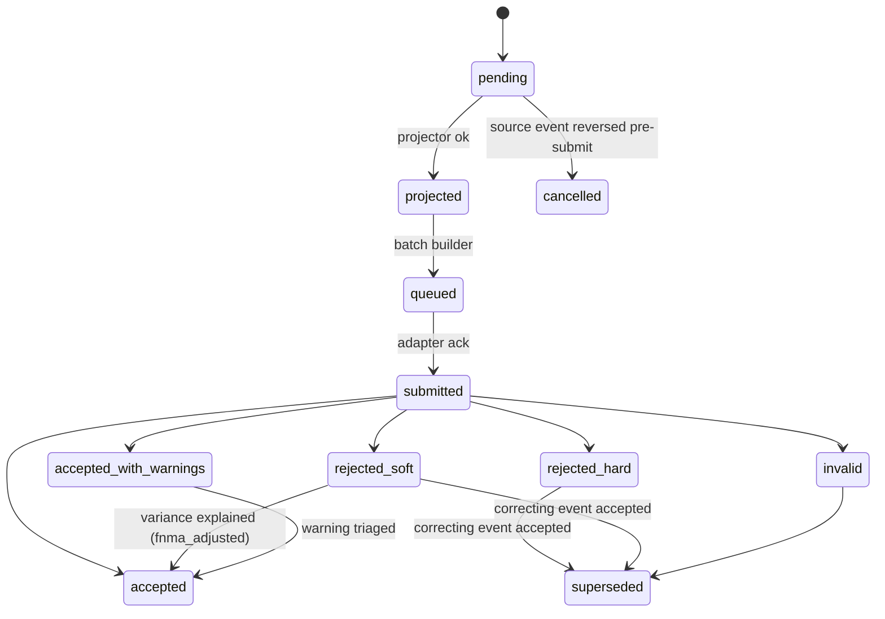

# 5.1 — Loan Activity Report (LAR) submission

| Attribute | Value |
|---|---|
| Section | 5 — Investor Reporting & Remittance (Fannie Mae) |
| Automation class | a |
| Trigger & frequency | Monthly per loan (in practice: per processed transaction, plus a monthly "no activity" report) |
| Governing source | FNMA IRM 2-04; C-4.3-01 |
| Key deadlines | LAR by 8pm ET next business day after processing; by 22nd calendar day regardless of payment |
| Timers | `FNMA_A14201_COMPFEE_WATCH`, `FNMA_C4301_LAR_NONREMOVAL_NEXTBD_2000`, `FNMA_IRM_BULK_CUTOFF_BD2_1500`, `FNMA_IRM_DEFERRAL_LAR_BEFORE_EOM_1BD`, `FNMA_IRM_LAR83_5BD_2000`, `FNMA_IRM_LAR89_PERIOD_END`, `FNMA_IRM_LAR_IRED_CD22_2000`, `FNMA_IRM_NONREMOVAL_CORRECTION_BD1_2000`, `FNMA_IRM_PERIOD_CLOSE_BD2_1700`, `FNMA_IRM_REJECT_TRIAGE_4H`, `FNMA_IRM_REMOVAL_CORRECTION_BD2_1700`, `FNMA_IRM_REMOVAL_NEXTBD_2000`, `FNMA_IRM_TT32_15CD`, `FNMA_LL202605_ESCROW_ATTEST_BD2`, `FNMA_LL202605_EVENT_NEXTBD_0300`, `FNMA_LL202605_NOPAYMENT_CD22`, `FNMA_LL202605_PERIOD_CLOSE_BD2_1700` |

### Blueprint row
| Field | Value |
|---|---|
| Area | Investor Reporting |
| Trigger & frequency | Monthly per loan (in practice: per processed transaction, plus a monthly "no activity" report) |
| Governing source (blueprint) | FNMA IRM 2-04; C-4.3-01 |
| Key deadlines (blueprint) | LAR by 8pm ET next business day after processing; by 22nd calendar day regardless of payment |
| Data/artifacts | LAR records |
| Systems | LSDU, Fannie Mae investor reporting system |
| Automation class (blueprint) | a |
| SoR / Sub | [cropped in source] — reconstructed: submissions carry the partner's servicer number; Supermortgage operates end-to-end under Form 101 authorization |
| Nuances (blueprint) | [cropped in source] — reconstructed: removal transactions have a different clock (next BD 8 p.m. / BD2 5 p.m.); corrections close BD1/BD2; entire portfolio must be reported; LARs are being replaced by LL-2026-05 servicing events per event type |

### Verified requirement (as of 2026-09-09)

**Servicing Guide C-4.3-01, Servicer Responsibilities Related to Investor Reporting (04/08/2026; Guide edition Aug. 12, 2026).** The servicer must "use an automated format to report all loan-level transactions on its entire mortgage loan portfolio using Fannie Mae's investor reporting system," reconcile Fannie Mae's reports to its records, and correct transactional errors and data discrepancies. Deadlines (operative language): a removal transaction (payoff, repurchase or foreclosure action) must be reported "by 5 p.m. eastern time on the next business day if the servicer processes the transaction in its system on the first business day of the month" and "by 8 p.m. eastern time on the next business day" otherwise; "corrections to reporting errors for removal transactions by 5 p.m. eastern time on the second business day of the month following the reporting period"; non-removal transactions "by 8 p.m. eastern time on the next business day after the servicer processes the transaction" and "by 8 p.m. eastern time on the 22nd calendar day of the month for all summary reporting mortgage loans, if no payment is received"; corrections to non-removal activity by 8 p.m. ET next business day and no later than the first business day of the following month. The topic points to the Investor Reporting Manual for codes and formulas.

**Investor Reporting Manual (IRM), April 8, 2026 edition (68 pp.; Ch. 1 General Requirements, Ch. 2 Reporting Payment Transactions, Ch. 3 Reporting Non-Payment Transactions, Ch. 4 Special Loan Handling, Ch. 5 Formulas and Calculations).**
- *Reporting due dates (p. 11):* for summary-reporting loans of every remittance type, a LAR "by 8 p.m. eastern time on the next business day after the servicer processes the payment transaction," and "a LAR must be reported by the twenty-second calendar day of the month of the reporting period regardless of whether a payment was received"; if the 22nd is a weekend/holiday, the preceding business day — the **Interim Reporting End Date (IRED)**. Removal transactions ("payoffs, repurchases, foreclosures, short sales, deeds-in-lieu, and third party sales") by 8 p.m. ET the first business day after processing, or **5 p.m. ET if that day is the second business day** of the following month; removal corrections by 5 p.m. ET BD2. Bulk submissions "cannot be performed via B2B electronic file transfer or through LSDU upload function after **3 p.m. eastern time on the second business day**." Detailed-reporting loans (daily simple interest, A/A biweekly) submit a LAR 96 **and** LAR 97 as payments are received, on the same clock.
- *Record layouts (pp. 12–14, 28–32), all 80 characters:* **LAR 96** — pos 1–9 lender (servicer) number; 10 investor `F`; 11–12 `96`; 13 source code, "always zero (0)"; 14–23 Fannie Mae loan number; 24–27 LPI date MMYY; 28–38 UPB S9(9)V99 zone-signed; 39–49 interest; 50–60 principal; 61–62 action code; 63–68 action date MMDDYY; 69–76 other fees S9(6)V99 (late charges, assumption fees, prepayment premiums collected in the period); 77–80 filler. Zone-sign map: `{`/`}` = ±0, `A–I` = +1..+9, `J–R` = −1..−9 (e.g., $50,000.01 → `0000500000A`; −$9.91 → `0000000099J`). **LAR 97** (extended LAR for DSI and A/A biweekly loans) — pos 13 reversal flag (0 normal, 1 reversal); 24–34 gross actual payment 9(9)V99; 35–42 payment effective date MMDDYYYY (must equal the LAR 96 action date month/year); 73–80 full LPI date MMDDYYYY. **TT 32** servicing transfer — pos 24–29 request effective date CCYYMM, 30–38 transferee lender number, 39–53 lender loan ID, 54–55 transfer request type (00 non-MBS, 10 MBS); due to Fannie Mae ≥15 days before the transfer effective date (Form 629 ≥60 days before; transfer finalized by the 25th of the prior month). **LAR 81** lender loan ID change — pos 24–38 new lender loan ID (15 AN). **LAR 83** payment/interest-rate change — pos 24–27 effective with payment due MMYY; 28–33 index value 99V9999; 34–39 new interest rate; 40–45 pass-through rate; 46–54 new payment 9(7)V99; 55–57 extended term; 58 converted-to-fixed `Y`; due "prior to 8 PM eastern standard time on the 5th Business Day after the Scheduled Interest Rate Calculation Date (Rate Effective Date minus the Look Back Period)"; ARM-to-fixed conversions by the reporting due date for the period containing the new payment's effective date. **LAR 89** MI discontinuance — pos 24–25 action code (51 borrower-initiated cancellation on original value; 52 on current appraised value; 53 automatic termination; 54 termination due to high risk); 26–31 action date MMDDYY; due "by the last reporting day of the reporting period in which the effective date of the termination occurs."
- *Action codes on LAR 96 (pp. 15, 19–24):* **00** payment/curtailment/no-payment for the 80-character format (**02** is the ANSI X12 equivalent), action date any date in the reporting month; **60** payoff — "submit a LAR with an Action Code 60 on the first business day after the servicer processes the transaction"; **65** repurchase and **67** repurchase of an ARM where the modification feature is exercised — in the next LAR 96 transmitted, action date within the current activity period; **70** "Charge-off/Liquidated Held for Sale for Uninsured Properties" (foreclosure sale held, redemption, mortgage release, VA no-upset); **71** "Liquidated Third-Party Sale / Condemnation / Short Sale" (also Fannie Mae-authorized second-lien charge-off); **72** "Charge-off/Liquidated – Foreclosure Sale Held for Insured Properties" (FHA/VA/MI conveyance pending).
- *Chapter 4 handling that constrains LAR content:* payment deferral (4-01/4-02) — pre-deferral UPB/LPI in SMDU must match the last accepted LAR; report the contractual payment "at least one business day before month-end" or the case cannot complete that month; post-deferral report **net** UPB (gross minus non-interest-bearing forbearance), never interest on forbearance, never the initial reduction as a curtailment; curtailments apply to interest-bearing UPB first unless ≥ interest-bearing UPB; payoff/repurchase must include the forbearance amount or the LAR **hard rejects**. Modifications (4-03) are reported by SMDU to the investor reporting system; the servicer then reports one LAR — a second LAR with movement in the same period is "Invalid." Reclassification (4-04) — remittance type becomes A/A as of the first of the reclass month and an A/A LAR must be accepted before the IRED or the exception "Missing LAR – Loan Reclass" is raised. Same-month MBS (4-05) — first-cycle scheduled principal hard-rejects; curtailments reduce balance and are reported as principal; prepaid installments in the issue month report reduced actual UPB with zero principal. Reinstatement of a >3-month delinquent loan (4-07) — interest reported = prior UPB × PTR ÷ 12 × Fannie Mae % × months from prior LPI through period end (two-part calculation across an ARM adjustment). **Errors after period close (4-08, dated 04/08/2026):** "Fannie Mae will not accept any update to Action Code 60 after the applicable reporting period has closed" — the payoff is final, the loan is not reactivated, and the servicer "remains responsible for remitting/advancing funds to liquidate"; repurchase action-date changes need a written justification to the Investor Reporting Representative; liquidation code changes go to the SF CPM division (70→71 cancels a REOgram; 71→70/72 requires one); ARM adjustment errors are re-amortized per F-1-01 with a cover letter and support — undercharges cannot be collected from the borrower and UPB cannot be changed; over-remittances to S/S MBS are not refundable.
- *Feedback and rejects:* LSDU shows Payment (LAR 96) Exceptions with type **Hard Reject, Soft Reject, Missing LAR** (15–30 minute latency), Invalid Transactions (current cycle only; e.g., LARs on inactive loans, MI-discontinuance exceptions), LAR 83 statuses (Accepted, Projection Applied, Projected, Rejected, Missing), Reclass transactions (24 months history); Missing-LAR reasons for CD23–BD2: "Missing LAR", "– New Acquisition", "– Delinquency Modification", "– Loan Reinstatement", "– Reclass"; file processing 30–60 minutes; near-real-time window 8:00 a.m.–9:00 p.m. ET (8:00 a.m.–6:00 p.m. ET on BD2); Fannie Mae Connect "Loan Activity Summary Report" refreshed 7:30 a.m. ET Tue–Sat / 2:30 p.m. Sun with Accepted / Hard Rejected / Soft Rejected / Invalid / Unreconciled counts (TT96 User Guide, Mar. 27, 2025). The published guides do **not** define the hard/soft distinction; the LSDU FAQ's "view Scheduled/Scheduled expected interest calculation for soft rejects" and the TT96 guide's six reject reasons (missing action code/date; payment on inactive loan → `readd_requests@fanniemae.com`; action date beyond current period; servicer match failure; invalid loan number) support the industry reading that a **hard reject is not applied and must be corrected/resubmitted**, while a **soft reject is applied with Fannie Mae's expected interest/principal and flags a variance to reconcile** **[PARTIALLY VERIFIED — confirm with the Investor Reporting Representative during onboarding]**.
- *Compensatory fees (A1-4.2-01, 12/21/2022):* late/inaccurate investor reporting — first instance the greater of $250 or $50 per loan up to $5,000; second $500/$50 up to $10,000; each subsequent within a year $1,000/$50 up to $15,000; delinquency status reporting is a separate monthly activity separately subject to fees.

**LL-2026-05 (June 24, 2026) and the Servicing Platform (replacement rails).** Servicers "will no longer be required to submit Transaction Type Reports or Loan Activity Records (LARs)" once each event type goes live. Events must be reported "the same day as the servicing events are processed in the servicer's systems, but no later than **3:00 a.m. eastern time on the next business day**"; a "no payment" event by the **22nd calendar day** (preceding business day if weekend/holiday); the period "will close at 5:00 p.m. eastern time on the second business day"; foreclosure events by the next business day. Servicing Changes Reference Guide v1.0 (Dec. 17, 2025) defines the Loan Contractual Payment event (attributes: transaction effective date, processed date, LPI due date, actual UPB, non-interest-bearing balance, suspense balance, interest rate, lender pass-through rate, P&I amount, **loan event sequence number** "unique per loan, reflects processing order"), response severities *Accepted / Accepted with Warnings / Rejected (fatal)*, fatal rules (valid loan number; servicer association; LPI day-of-month; effective date not earlier than latest accepted event and not in the future; LPI not > current LPI + one period and not ≤ current LPI; loan active; NIB balance aligned; **UPB variance > ±$0.05 fatal**) and warnings (rate, P&I, pass-through misalignment), and the activity-period assignment table (effective date before the 1st → earliest period; current month non-liquidation by BD2 5 p.m. → latest period; current-month liquidation by BD2 → earliest period; anything after BD2 5 p.m. → latest). Channels: Servicing Events API (Swagger only after credentialing; API Planning Guide v2.0), B2B files with the same JSON schemas, and the Servicing Platform UI CSV (≤5 MB, ≤12,000 events, ≤100 events per loan per file, one event type per file; sequence numbers ≥1, unique and increasing per loan, gaps allowed). CIT plans: **Delinquency Reporting** CIT Oct. 14, 2026–Feb. 12, 2027, production **Mar. 15, 2027** (cycles Oct 14–Nov 6, Nov 16–Dec 18, optional Jan 14–Feb 12; complete Cycle 1 or 2); **Loan Data Change** CIT Nov. 2, 2026–Feb. 12, 2027, production **Mar. 8, 2027** (UI only); **Escrow** production window July 18–Dec. 1, 2026; **Liquidation** CIT 10/08/2026–03/12/2027 with go-live window 2/20–3/15/2027 **[PARTIALLY VERIFIED — Timeline v3.0 is a graphic; the two "3/08" and "3/15" go-live strings are anchored to the LDC and delinquency CIT plans, leaving the remaining bar for liquidation]**; **Payment Event Reporting and Cash Position Management** (the LAR 96/97 and A/A auto-draft replacement) has no published dates (industry commentary: 2028). "Servicers must comply by the final Go Live dates." FAQ v1.6 (July 22, 2026): the **acting servicer** ("a master servicer not using sub-servicers, or a sub-servicer performing servicing on behalf of another servicer") completes the Implementation Readiness Tracker and reports on the same schedule.

**Discrepancies with the blueprint row:** (1) the trigger is transactional (next-BD clock) with a monthly floor, not "monthly per loan"; (2) removal transactions (payoff/repurchase/liquidation) have their own 8 p.m./5 p.m. BD2 clock and a BD2 correction close, absent from the row; (3) "IRM 2-04" is the repurchase/liquidation section — the LAR layout and due dates are IRM Ch. 1–2 (pp. 11–14) and Ch. 3; (4) LAR 83/89/81/32 deadlines are separate; (5) research/00b's LAR 96 "source code 0 original / 1 correction" is wrong — IRM p. 12 says source code is always 0 (the reversal flag is on LAR 97 pos 13); (6) LARs are being retired event-type by event-type under LL-2026-05, so this process must be built dual-rail from day one.

Regulation X/Z impose no investor-reporting deadline; the only federal hooks are record retention (12 CFR 1024.38(c) — one year after transfer/discharge; Fannie Mae A2-5-01 life-of-loan + 4 years governs here) and accuracy of servicing records generally. (eCFR was not re-fetched for this section — the egress proxy denies ecfr.gov; cross-cutting Reg X status is in research/00a.)

### Operational prerequisites
- **Fannie Mae servicer approval for Supermortgage** (A2-1-07) — Partner SoR confirms; Supermortgage owns its ECRM Form 1010 approval; lead time 90+ days after a complete package (research/00a §4.3).
- **Technology Manager provisioning under the partner's 9-digit servicer number:** LSDU roles *External Update* (report LARs) and *External Seller Update* (PPAs), *External Upload Only* for the upload-only System ID; AMN/Servicing Platform access; Fannie Mae Connect report categories (Investor Reporting, Remittance, Draft Notifications). Owner: Partner's Corporate Administrator provisions; Supermortgage employees hold the credentials (Technology Guide). Lead time 2–4 weeks.
- **Form 101 Data Access Authorization** (Master Subscriber = partner, Subordinate Subscriber = Supermortgage) scoped to LSDU, CRS, Servicing Platform, AMN, Fannie Mae Connect, Property 360 and the partner's servicer numbers — executed at inception (and again at termination) — Owner: both; artifact: TR101 emailed to `Technology_Registration@fanniemae.com`.
- **System IDs** for B2B/CPU-to-CPU LAR transfer and for the Servicing Events API (`fnma-auth` ROPC credentials, integration environment `api-clve.fanniemae.com`) — Owner: partner's CA creates; Supermortgage TSP identity via TSP Intake Form + Integration Agreement (2–6 months) — research/00b F14.
- **Servicing Platform onboarding:** express interest to `future_of_servicing@fanniemae.com`, Integration Team kickoff, API Integration Guide + Swagger, CIT completion per event type (escrow before Dec. 1, 2026; delinquency Oct. 14, 2026–Feb. 12, 2027; LDC Nov. 2, 2026–Feb. 12, 2027), Implementation Readiness Tracker entries as acting servicer — Owner: Supermortgage with partner sign-off.
- **Investor Reporting Representative and Master Servicing contacts** (F-4-02 List of Contacts) recorded in `integration_contacts`; `readd_requests@fanniemae.com`, `master_servicing@fanniemae.com`, `Investor_Reporting_Group_Mailbox@FannieMae.com` on the allowlist for agent-drafted, human-sent correspondence.
- **2026/2027 Investor Reporting and Remitting Calendar** loaded into `holiday_calendars` (`fannie_et`) with Fannie Mae-only observed holidays flagged **[PARTIALLY VERIFIED — the published calendar is graphic; transcribe manually each December]**.
- **Boarding data completeness** (Section 1.1): Fannie Mae loan number, remittance type, participation percentage, PTR, servicing fee, g-fee, MBS pool/issue date and remittance cycle (standard/RPM/MBS Express), summary vs detailed reporting flag, non-interest-bearing balances — without which no LAR can be projected.

### Build spec
#### Inputs and triggers
- Loan events from Section 2 cashiering: `payment.received`, `payment.applied`, `payment.reversed`, `payment.curtailment.applied`, `payment.prepaid.applied`, `fee.collected` (late charge/assumption/prepayment premium), `suspense.applied`.
- Loan-term events: `loan_terms.rate_changed` (ARM index/rate), `loan_terms.payment_changed`, `loan_terms.converted_to_fixed`, `loan.servicer_loan_id.changed`, `loan.deferral.completed`, `loan.modification.completed` (SMDU-reported; triggers the single post-modification LAR), `loan.reclassified` (purchase advice received), `scra.rate_reduction.applied`.
- Removal events (5.3/5.6/16.2): `payoff.funds.received`, `repurchase.approved`, `liquidation.recorded`.
- MI events (Section 10): `mi.cancelled`, `mi.terminated`.
- Schedules: `timer-sweep` for IRED (CD22) "no activity" projection; BD1/BD2 close jobs; `lar83` 5-BD-after-calculation-date job; daily 06:00 ET feedback pull.
- Inbound: LSDU B2B acknowledgements and exception extracts; Fannie Mae Connect Loan Activity Summary Report; Servicing Platform API responses; purchase advices (reclass); SMDU modification acceptance.

#### Data model
New tables (all `bigint` cents, `timestamptz`, retention class `life_of_loan_plus_4y`, no borrower PII beyond Fannie Mae loan number and servicer loan ID; LAR files stored as `documents` with SHA-256):
- `investor_events` (baseline table, defined here): `id`, `loan_id`, `servicer_number` (partner 9-digit), `fnma_loan_number` (10), `event_type` (enum below), `event_family` ∈ {payment, nonpayment, removal, delinquency, escrow, loan_data_change, mi, transfer, scra}, `effective_date` (date), `processed_at`, `activity_period` (YYYY-MM as assigned by the period rule), `per_loan_sequence` (bigint, monotonic per loan), `payload` (jsonb, canonical MISMO-aligned attribute set), `source_loan_event_id`, `supersedes_event_id`, `status`, `channel` ∈ {lsdu_b2b, lsdu_upload, lsdu_single, se_api, se_b2b, se_csv, amn_b2b, amn_upload, human_portal}, `projection_format` ∈ {lar80, se_json_v1, amn_fixed, csv}, `projection_document_id`, `idempotency_key` (unique), `submission_id`, `fnma_response` (jsonb), `rule_set_version`, `created_at`. Append-only; corrections are new rows with `supersedes_event_id`.
- `investor_event_types` (reference, versioned by `rule_sets`): `event_type`, `legacy_record` (96/97/81/83/89/32/AMN), `legacy_action_code`, `se_event_name`, `channel_mode` ∈ {legacy, dual, event} with `effective_from`, `deadline_timer_code`.
- `investor_submissions`: `id`, `servicer_number`, `channel`, `format`, `document_id`, `record_count`, `submitted_at`, `ack_status`, `fnma_submission_id`, `processed_at`, `accepted_count`, `rejected_count`, `warning_count`.
- `investor_event_exceptions`: `event_id`, `source` ∈ {lsdu, se, amn, connect}, `severity` ∈ {hard, soft, invalid, missing, fatal, warning, notification}, `code`, `message`, `fnma_expected` (jsonb: expected interest/principal/UPB/LPI), `detected_at`, `triage` (jsonb decision record ref), `resolution` ∈ {resubmitted, superseded, ppa_filed, fnma_adjusted, closed_manual, accepted_as_is}, `resolved_at`, `deadline_timer_id`.
- `investor_loan_positions` (Fannie Mae's last accepted view per loan): `loan_id`, `fnma_lpi_date`, `fnma_actual_upb_cents`, `fnma_scheduled_upb_cents`, `fnma_nib_balance_cents`, `fnma_ptr`, `fnma_note_rate`, `fnma_pi_cents`, `remittance_type`, `participation_pct` (decimal 9,6), `last_accepted_sequence`, `as_of`, `source` (lsdu_trial_balance | se_loan_position | purchase_advice).
- `investor_reporting_periods`: `servicer_number`, `period` (YYYY-MM), `opens_at`, `ired_at`, `bulk_cutoff_at`, `close_at`, `status` ∈ {open, interim_closed, closed, attested}, `close_checklist` (jsonb), `attested_by_agent_run_id`.
- `investor_loan_sequences`: `loan_id`, `next_sequence` (row-locked allocator).
- Feature flags (`rule_sets` bundle `fnma.investor_reporting.channels`): `investor_reporting.<event_type>.mode = legacy|dual|event` with effective dates (escrow.*: event from 2026-12-01 (dual from 2026-10-01 in CIT); delinquency.status: dual 2027-02-01, event 2027-03-15; loan_data.change: event 2027-03-08; removal.liquidation.*: dual Q1 2027 per Liquidation CIT plan; payment.*: legacy until Fannie Mae publishes dates).

`event_type` enum: `payment.contractual`, `payment.curtailment`, `payment.reversal`, `payment.none`, `payment.prepaid`, `fees.collected`, `rate_payment.change`, `loan_id.change`, `loan_data.change`, `mi.discontinuance`, `removal.payoff`, `removal.repurchase`, `removal.liquidation.uninsured`, `removal.liquidation.third_party`, `removal.liquidation.insured`, `delinquency.status`, `escrow.setup`, `escrow.deposit`, `escrow.disbursement`, `escrow.modification`, `transfer.servicing`, `scra.rate_reduction`.

#### State machine
`investor_events.status`: `pending` (created, not yet projected) → `projected` (format rendered, validated locally) → `queued` (in an `integration_messages` outbox batch) → `submitted` → {`accepted`, `accepted_with_warnings`, `rejected_hard`, `rejected_soft`, `invalid`, `missing`} → (`rejected_*`/`invalid` → `superseded` when a correcting event is accepted) ; `cancelled` (event withdrawn before submission, e.g., payment reversed same day); terminal: `accepted`, `accepted_with_warnings` (after warning triage closes), `superseded`, `cancelled`. Transitions to `submitted` are made by the `fnma-lsdu`/`fnma-servicing-events` adapters; to `accepted/rejected` only by parsed Fannie Mae responses (never by the agent); `superseded` by the command that accepts the correcting event; `closed_manual` on exceptions requires an `agent_decisions` record and, if Fannie Mae records are changed outside our submission (PPA, Investor Reporting Representative adjustment), an `escalations` record to `fnma_portal_operator`. Head-of-line rule: a loan with an open `rejected_hard`/`invalid` event blocks submission of later-sequence events for that loan until the reject is superseded or waived with reason.

#### Timers and gates
| Timer code | Kind | Trigger event | Anchor | Offset & unit (calendar) | Satisfied by | Breach action |
|---|---|---|---|---|---|---|
| `FNMA_C4301_LAR_NONREMOVAL_NEXTBD_2000` | deadline | `investor_events.created` (family payment/nonpayment) | `processed_at` | next business day 20:00 America/New_York (`business_days_fannie_et`, 1) | `investor_events.submitted` (same event) | warn 70%; breach → escalation `investor-reporting` sev-2, Compliance Sentinel daily report |
| `FNMA_IRM_LAR_IRED_CD22_2000` | deadline (recurring monthly, per loan) | `investor_reporting_periods.opened` | calendar day 22 (preceding BD if not BD) 20:00 ET | 0 | any accepted `payment.*` event in period **or** `payment.none` submitted | breach → immediate `payment.none` auto-submit + sev-2 escalation |
| `FNMA_IRM_REMOVAL_NEXTBD_2000` | deadline | `investor_events.created` (family removal) | `processed_at` | next `fannie_et` BD 20:00 ET, **17:00 ET if that day is BD2** | `submitted` | sev-1 escalation (compensatory-fee exposure; SVC-2026-03 finality) |
| `FNMA_IRM_REMOVAL_CORRECTION_BD2_1700` | deadline | `investor_event_exceptions.detected` on removal | period end | BD2 17:00 ET of following month | `superseded` | sev-1; after breach the action code 60 is final (IRM 4-08) — open `qc_finding` case |
| `FNMA_IRM_NONREMOVAL_CORRECTION_BD1_2000` | deadline | exception on non-removal event | period end | BD1 20:00 ET following month | `superseded`/`accepted` | sev-2 |
| `FNMA_IRM_BULK_CUTOFF_BD2_1500` | not_before_gate (inverse: no bulk after) | period close job | BD2 15:00 ET | 0 | — | after cutoff, adapter switches bulk channel off; remaining items → `lsdu_single` human task or next period |
| `FNMA_IRM_PERIOD_CLOSE_BD2_1700` | deadline | period | BD2 17:00 ET | 0 | `investor_reporting_periods.closed` with checklist complete | sev-1 escalation to `officer` if unreconciled |
| `FNMA_IRM_LAR83_5BD_2000` | deadline | `loan_terms.rate_changed` scheduled | scheduled interest-rate calculation date (rate effective date − look-back) | 5 `business_days_fannie_et` 20:00 ET | `rate_payment.change` submitted | sev-2 |
| `FNMA_IRM_LAR89_PERIOD_END` | deadline | `mi.cancelled`/`mi.terminated` | effective date | last reporting day of that period (BD2 17:00 ET next month) | `mi.discontinuance` accepted | sev-2 |
| `FNMA_IRM_TT32_15CD` | deadline | `transfer_out.approved` (Section 17.1) | transfer effective date | −15 calendar days | `transfer.servicing` accepted | sev-1 |
| `FNMA_IRM_DEFERRAL_LAR_BEFORE_EOM_1BD` | deadline | `lossmit.deferral.approved` | last day of processing month | −1 `business_days_fannie_et` | contractual-payment LAR accepted | sev-2 (deferral slips a month) |
| `FNMA_LL202605_EVENT_NEXTBD_0300` | deadline | `investor_events.created` where mode=event | `processed_at` | next `fannie_et` BD 03:00 ET | `submitted` | sev-2 |
| `FNMA_LL202605_NOPAYMENT_CD22` | deadline | period | CD22 (preceding BD) 23:59 ET | 0 | `payment.none` accepted | sev-2 |
| `FNMA_LL202605_PERIOD_CLOSE_BD2_1700` | deadline | period | BD2 17:00 ET | 0 | period closed | sev-1 |
| `FNMA_LL202605_ESCROW_ATTEST_BD2` | deadline | period (escrow) | BD3 opens; due BD2 of following month 17:00 ET | 0 | `human_portal_task` completed with attestation evidence | sev-1 |
| `FNMA_IRM_REJECT_TRIAGE_4H` | deadline (internal SLA) | `investor_event_exceptions.detected` | detected_at | 4 hours (any day) | triage decision recorded | sev-3 |
| `FNMA_A14201_COMPFEE_WATCH` | recurring | monthly | — | — | — | informational: counts late/inaccurate instances toward the $250/$500/$1,000 ladder |

Jurisdiction overrides: none (Fannie Mae ET calendar only). All `time_of_day_tz` values are America/New_York.

#### Business rules and calculations
1. **Canonical event creation.** Every qualifying loan event creates exactly one `investor_events` row in the same transaction (command → events → projections). `per_loan_sequence` is allocated from `investor_loan_sequences` under `SELECT … FOR UPDATE`, in processing order, never reused; corrections take a new sequence and `supersedes_event_id`.
2. **Activity period assignment** (Reference Guide table; identical for LAR): effective date earlier than the 1st of the current month and processed by BD2 17:00 ET → prior (earliest open) period; current-month non-removal by BD2 → current period; current-month removal processed by BD2 → earliest open period; anything after BD2 17:00 ET → current period. The engine keeps at most two open periods per servicer number.
3. **Projection — LAR 96.** From the loan's ledger after posting: LPI date (MMYY of the last fully paid installment), UPB = interest-bearing actual UPB (net of `deferred_principal`/`forborne_principal`), interest and principal = Fannie Mae's share computed per remittance type (5.2 formulas), action code, action date, other fees = sum of `fees.collected` in period. Interest for A/A = interest actually collected at PTR × participation; S/A = scheduled interest (prior actual UPB × PTR ÷ 12 × participation) regardless of collection; S/S = prior **scheduled** UPB × PTR ÷ 12 × participation; principal A/A and S/A = prior actual UPB − current actual UPB (× participation); S/S = prior scheduled UPB − current scheduled UPB. Rounding: each monetary field round-half-up to cents at the field; zone-sign encode the last digit; totals across a file are not rounded again. **Worked example** (S/S MBS, UPB $250,000.00, note 6.500%, servicing fee 0.250%, g-fee 0.250%, PTR 6.000%, P&I $1,580.17, 100% participation): gross interest = 250,000 × 0.065 ÷ 12 = $1,354.17; scheduled principal = 1,580.17 − 1,354.17 = $226.00; ending scheduled UPB $249,774.00; LAR 96 interest = 250,000 × 0.06 ÷ 12 = **$1,250.00** (`0000125000{`), principal **$226.00** (`0000022600{`), UPB `0024977400{`, LPI advanced one month, action code `00`.
4. **"No activity" projection.** On the IRED sweep (CD22 preceding-BD, 18:00 ET run so there is a 2-hour buffer to 20:00), every active loan under a summary-reporting servicer number with no accepted `payment.*` event in the period gets `payment.none` (LAR 96 with unchanged LPI/UPB, zero interest/principal, action `00`) — or, when `mode=event`, the No Payment Event confirming UPB and LPI.
5. **Detailed reporting loans** (DSI, A/A biweekly): every payment produces LAR 96 + LAR 97 (gross payment, payment effective date MMDDYYYY, full LPI); reversals set LAR 97 pos 13 = 1.
6. **Projection — servicing event JSON.** Same canonical payload mapped to the published schema names (Loan Servicer Transaction Effective Date, Loan Servicer Transaction Processed Date, Loan Last Paid Installment Due Date, Loan Actual UPB Amount, Loan Non-Interest Bearing Balance Amount, Loan Suspense Balance Amount, Loan Interest Rate, Loan Lender Pass Through Rate, Loan Principal and Interest Payment Amount, Loan Event Sequence Number); amounts as decimals with two places, no symbols, leading minus for negatives; dates YYYY-MM-DD. Field names beyond the Reference Guide list are **[UNVERIFIED — take from the Master Servicing Technical Specifications zip/Swagger at credentialing]**. Local pre-validation replicates every published fatal rule (UPB within ±$0.05 of Fannie Mae's projection in `investor_loan_positions`; LPI exactly one period forward; effective date ≤ today and ≥ last accepted).
7. **Dual mode.** When `mode=dual` (CIT/parallel run) the event is projected to both formats; only the legacy projection is sent to production, the JSON goes to the CIT environment (`api-clve`), and the two responses are diffed into `investor_event_exceptions` with severity `notification`.
8. **Idempotency & resubmission.** `idempotency_key = sha256(servicer_number|fnma_loan_number|event_type|effective_date|per_loan_sequence|payload_hash)`; a resend after a transport failure reuses the key and the same file content; a correction is a **new** event with a new key. LAR duplicate protection: the batch builder never places two records for the same loan and event family in one file unless the IRM permits (e.g., LAR 96 + LAR 97 pair; LAR 96 + LAR 83).
9. **Reject handling loop.** Feedback is polled at 15-minute intervals during the LSDU near-real-time window (08:00–21:00 ET; 08:00–18:00 BD2) and once after the Connect Loan Activity Summary refresh. `hard`/`invalid`/`fatal` → triage within 4 hours: (a) our-data error (e.g., LPI/UPB mismatch to ledger) → fix ledger via Section 2 correction command → new event → resubmit; (b) Fannie Mae position mismatch (our ledger is right) → PPA/Loan Data Change request package → `fnma_portal_operator`; (c) inactive loan we believe active → `readd_requests@fanniemae.com` package; (d) sequencing (event out of order) → re-queue in order. `soft` → compute variance vs `fnma_expected`; if our figures are wrong, correct; if Fannie Mae's expected interest is wrong (curtailment-in-period, reverse amortization), document and route to Master Servicing (`master_servicing@fanniemae.com`) with pay history — status stays `rejected_soft` until Fannie Mae adjusts or period closes, then `accepted` with `resolution=fnma_adjusted|accepted_as_is` and an audit note. `missing` (CD23–BD2) → generate the missing LAR immediately (usually a reclass, reinstatement or new acquisition where the loan was not yet boarded to reporting).
10. **Period close (BD2).** Checklist executed by the agent: (i) every active loan has an accepted event or accepted `payment.none`; (ii) zero open hard/invalid rejects; (iii) all removals processed on/before BD1 reported by the BD2 17:00 ET clock (bulk by 15:00); (iv) LSDU trial balance vs `investor_loan_positions` diff = 0 loans (LPI, UPB, PTR, remittance type); (v) soft rejects each carry a triage record; (vi) cash-position preview matches `remittance_calculations` (5.2) within $0.00 for S/S and S/A drafts; (vii) delinquency file accepted (5.7); (viii) escrow attestation package prepared (from Dec. 2026). The period row moves to `closed`; the checklist JSON, the diff report and the agent decision are stored as `documents`.
11. **Post-close finality.** After BD2 17:00 ET: no `removal.payoff` correction is projected (IRM 4-08); the engine instead opens a `qc_finding` case and, where a payoff was reported in error, computes the amount to remit/advance (5.2/16.2) so the loan is liquidated in Fannie Mae's records while our ledger keeps servicing it as a portfolio/non-Fannie asset until the partner and Fannie Mae agree the disposition **[design decision — see Open questions]**.

#### Integrations
- **`fnma-lsdu` (LAR channel).** Direction: outbound files / inbound acknowledgements and extracts. Primary transport: **CPU-to-CPU (B2B) electronic file transfer** under a System ID (transport details — SFTP/HTTPS — are provided by Fannie Mae at onboarding **[UNVERIFIED]**); fallback: LSDU file upload (.txt/.dat, 80-char records, one CR per record, mixed types allowed) as a `human_portal_task`; last resort: LSDU single-LAR screen (`human_portal_task`). Ack: LSDU Completed File Upload Search status (30–60 min), Payment (LAR 96) Exceptions (15–30 min), Invalid Transactions, LAR 83 statuses; daily Connect Loan Activity Summary Report (via `fnma-connect` API where the report is exposed, else human pull). Failure: retry transport 3× with backoff within the deadline window; at deadline−2h with no ack → `human_portal_task` upload package (file + manifest + deadline). Sandbox: none for LAR (LSDU has no test region **[UNVERIFIED]**) — contract tests use fixture files validated by the codec (positions, zone signs, record length).
- **`fnma-servicing-events` (event channel).** Outbound JSON via REST (OAuth 2.0 ROPC token from `fmsso-api.fanniemae.com/as/token.oauth2`, headers `x-fnma-api-key`, `x-fnma-access-token`, `x-fnma-channel: api`; endpoints from the API Integration Guide/Swagger **[UNVERIFIED until credentialed]**); B2B file alternative with the same schemas; UI CSV (≤5 MB/12,000 events/100 per loan, one event type per file) as `human_portal_task` fallback. Responses carry Submission ID and per-event Accepted / Accepted with Warnings / Rejected with exception messages; "all inbound transactions … receive responses via the same protocol." CIT environment `api-clve` (static snapshot as of BD2 Mar. 3, 2026; closed Fri 03:00–Mon 09:00 ET; maintenance closures Oct 23–25, Nov 25–29, Dec 19–Jan 13, Jan 22–24). Failure: 5xx/timeouts → exponential retry with the same idempotency key until deadline−1h, then CSV fallback task.
- **`fnma-connect`.** Loan Activity Summary Report, Remittance Detail – P&I, draft notifications (Loan-Level Draft Notifications API); UI pull by `fnma_portal_operator` where no API product covers a report.
- **`fnma-smdu`** (read): modification/deferral acceptance → triggers the single post-workout LAR; purchase advice (reclass) → remittance-type flip.
- **Human portal task package (all LSDU/Servicing Platform UI steps):** file(s) with SHA-256, record count, servicer number, deadline (ET), step-by-step screen path, expected confirmation artifact (screenshot/Submission ID) to attach on completion, and the rollback instruction if the upload fails validation.

#### Outputs and artifacts
- Investor events (accepted) → `investor_loan_positions` updated; `investor_submissions` with the exact file/JSON as a `documents` artifact; `integration_messages` outbox rows with idempotency keys.
- Period close package: checklist JSON, trial-balance diff, exception ledger, Loan Activity Summary snapshot, agent close decision — `documents` class `life_of_loan_plus_4y` (portfolio-level: `fnma_reporting_7y`).
- No borrower notices are emitted by this process.
- Ledger postings: none directly (cash moves in 5.2); memo entries `fnma_reported_interest`/`fnma_reported_principal` per period for reconciliation.

#### AI agent design (AI-first)
`investor-reporting` agent (package `agents/investor-reporting`) runs the whole loop: builds and validates projections, sequences and batches, submits through adapters, reads acks, triages exceptions, files corrections, executes the BD2 close and drafts any correspondence to Fannie Mae. Tools: `projectEvent`, `validateLar80`, `validateSeJson`, `submitBatch(channel)`, `pollFeedback`, `diffTrialBalance`, `createCorrection`, `openPortalTask`, `draftFnmaEmail`, `recordDecision`. Decision record (`agent_decisions`): `{event_id, exception_code, root_cause ∈ {ledger_error, fnma_position_mismatch, sequence, inactive_loan, schema, unknown}, evidence[], action, deadline_at, confidence, model_version, rule_set_version}`. Guardrails: cannot alter ledger balances directly (must issue Section 2 correction commands that themselves post reversing entries); cannot mark an event `accepted` without a parsed Fannie Mae response; cannot submit a removal correction after BD2 17:00 ET; confidence < 0.8 on root cause → hold and escalate. Escalations: `fnma_portal_operator` for every UI-only submission (LSDU upload/single LAR, PPA, CSV upload, attestation) and for emails that change Fannie Mae records (PPA justifications, re-add requests, IRR letters) — the agent attaches the full package; `officer` when the BD2 close cannot be completed clean (unreconciled loans or open hard rejects at 16:00 ET BD2) or when a compensatory-fee instance is likely; `attorney` never (no legal filings here). Toggle-off path: with `agents.investor_reporting.enabled=false` the same pipeline runs deterministically and a human operator works the exception queue in `ops-console` with the same decision-record schema. No borrower contact occurs in this process, so TCPA/state AI-disclosure rules do not apply.

#### Edge cases and failure modes
- **Transfer-in mid-period:** loans board with Fannie Mae's last accepted position (trial balance) as `investor_loan_positions`; first LAR must reconcile to it; "Missing LAR – New Acquisition" expected CD23–BD2 if boarding lags.
- **Transfer-out:** TT32 ≥15 days before the effective date (Form 629 30/60 days); final period reported by transferor through the transfer date; post-transfer events blocked.
- **Reversal after submission, same period:** new correcting event (negative principal/interest, LPI rolled back) before BD1 20:00 ET; LAR 97 reversal flag for DSI/biweekly.
- **Reversal after period close:** report in the current period with backward LPI movement (IRM liquidation/interest formulas with ×(−1)); never edit the closed period.
- **Payoff reported in error after close:** final (SVC-2026-03) — escalate, compute remit/advance amount, open `qc_finding`.
- **Bankruptcy/SCRA overlays:** SCRA 6% reductions are reported via Form 1022 (portfolio/PFP, by BD9) or the SCRAMS file upload for MBS (by CD15) and, for ARMs, LAR 83 — F-1-19; interest passed through at PTR continues for MBS and Fannie Mae disburses the shortfall two days before month-end (Section 13.9 owns the borrower side).
- **Disaster forbearance:** no LAR change (still `payment.none` monthly; delinquency status in 5.7; forbearance itself reported in SMDU).
- **Deferral/modification month collisions:** IRM 4-01/4-03 sequencing (contractual payment LAR before post-workout balances; a second movement LAR in the same period is Invalid).
- **Same-month MBS pooling:** first-cycle scheduled principal hard-rejects — projector suppresses scheduled principal in the issue-month cycle.
- **Vendor outage (B2B down):** fallback to UI upload task; if LSDU itself is down past 20:00 ET, document the outage (Fannie Mae technology-availability page) for compensatory-fee defense.
- **Holiday ambiguity:** Fannie Mae-only holidays (e.g., day after Thanksgiving) shift reporting deadlines but not necessarily Federal Reserve draft settlement — calendar table carries both flags.
- **Duplicate submission:** idempotency key + per-loan sequence; LSDU would apply a duplicate LAR 96 as a second payment — the batch builder de-duplicates by key before file creation.

#### Test cases and acceptance criteria
| ID | Given / When / Then |
|---|---|
| 5.1-T1 | Given an S/S loan ($250,000, 6.5%, PTR 6.0%) with a contractual payment processed Tue 2026-10-13 15:10 ET, when the event is created, then a LAR 96 with interest `0000125000{`, principal `0000022600{`, UPB `0024977400{`, action `00` is submitted before Wed 2026-10-14 20:00 ET and timer `FNMA_C4301_LAR_NONREMOVAL_NEXTBD_2000` is satisfied. |
| 5.1-T2 | Given a loan with no payment by CD22 (Thu 2026-10-22), when the 18:00 ET sweep runs, then `payment.none` is submitted before 20:00 ET; if Nov 22 (Sunday), then the sweep runs Fri 2026-11-20. |
| 5.1-T3 | Given a payoff processed Mon 2026-11-02 (BD1), then the action-code-60 LAR is due Tue 2026-11-03 **17:00** ET (BD2); processed Fri 2026-10-30 → due Mon 2026-11-02 20:00 ET. |
| 5.1-T4 | Given a hard reject "LPI mismatch" received 2026-10-14 09:40 ET, when triage finds a ledger posting error, then a Section 2 correction, a superseding event with a new sequence and the same period are accepted before BD1 of the next month; head-of-line blocking prevents later events for that loan from being sent first. |
| 5.1-T5 | Given a payoff LAR accepted in October 2026 and the error discovered 2026-11-05, then no correction is projected, a `qc_finding` case opens, and the remit/advance amount is computed. |
| 5.1-T6 | Given `investor_reporting.escrow.deposit.mode=dual`, when an escrow deposit posts, then JSON goes to `api-clve` and no LAR is created (escrow has no LAR); when `mode=event` on 2026-12-01, the JSON goes to production and must be submitted by 03:00 ET next BD. |
| 5.1-T7 | Given a bulk file still unacknowledged at BD2 14:00 ET, then the adapter re-sends once and, failing an ack by 14:30, opens a `human_portal_task` with the file, due 15:00 ET. |
| 5.1-T8 | Given a LAR 96 amount −$9.91 principal, then encoding is `0000000099J`; $800.02 interest → `0000008000B`; record length is exactly 80 with CR. |
| 5.1-T9 | Given an ARM rate calculation date 2026-10-01 (look-back 45 days, effective 2026-11-15), then LAR 83 is due by the 5th `fannie_et` BD after 2026-10-01 = Thu 2026-10-08 20:00 ET. |
| 5.1-T10 | Given two events for the same loan processed in order (curtailment then contractual), then sequences 1 and 2 are assigned in that order and submitted in the same file in that order; a replay of the batch produces zero new rows (idempotency). |
| 5.1-T11 | Given the agent is disabled, then the exception queue is worked by a human with identical decision-record fields and all timers still fire. |
| 5.1-T12 | Given a soft reject on interest where Fannie Mae's expected interest ignores a mid-month curtailment, then the agent produces a Master Servicing package with pay history and the event closes `accepted_as_is` at period close with the decision record attached. |

#### Audit and evidence
Every event's projection file/JSON (hash), submission time, Fannie Mae response (raw), exception, triage decision (`agent_decisions` with model/prompt/rule-set versions), timer history (`timers` with satisfied_by_event_id), period-close checklist and trial-balance diff, and all human portal task completions (screenshot/Submission ID) are retained `life_of_loan_plus_4y` and exportable per period for MORA/STAR "reporting timeliness/accuracy" reviews and for compensatory-fee disputes (A1-4.2-01).

### Open questions / decisions
1. **Hard vs soft reject semantics** — default: treat soft rejects as applied-with-variance requiring reconciliation, hard rejects as not applied; confirm with the Investor Reporting Representative at onboarding.
2. **B2B transport for LARs** (CPU-to-CPU specifics) — default: build the codec now; plug transport at onboarding; UI upload fallback via `fnma_portal_operator`.
3. **Payment-event/auto-draft go-live** unknown — default: `payment.*` stays legacy with the JSON projector kept in dual mode against CIT once Fannie Mae opens it.
4. **Erroneous post-close payoff** — default: partner funds the liquidation from its own money per IRM 4-08, Supermortgage bears cost only if caused by its error (contract clause).
5. **Fannie Mae-only holidays** — default: treat every day marked on the Fannie Mae calendar as a non-business day for reporting deadlines; treat Federal Reserve holidays as non-settlement days for drafts.
6. **Two open periods** — default: allow BD1–BD2 dual-period handling exactly as the Reference Guide table; block any third period.

### Sources
- Servicing Guide C-4.3-01 (04/08/2026): https://servicing-guide.fanniemae.com/svc/c-4.3-01/servicer-responsibilities-related-investor-reporting (verified 2026-09-09)
- Investor Reporting Manual, April 8, 2026: https://singlefamily.fanniemae.com/media/7816/display (verified 2026-09-09; pp. 7–14, 19–24, 28–32, 33–46)
- Announcement SVC-2026-03 (Apr. 8, 2026): https://singlefamily.fanniemae.com/media/document/pdf/announcement-svc-2026-03-servicing-guide-update (verified 2026-09-09)
- A1-4.2-01 Compensatory Fees Other Than Delays in the Liquidation Process (12/21/2022): https://servicing-guide.fanniemae.com/svc/a1-4.2-01/compensatory-fees-other-delays-liquidation-process (verified 2026-09-09)
- LSDU User Guide (Feb. 2026): https://singlefamily.fanniemae.com/media/document/pdf/loan-servicing-data-utility-user-guide ; LSDU FAQs: https://singlefamily.fanniemae.com/applications-technology/loan-servicing-data-utility-lsdu/faqs-loan-servicing-data-utility-lsdu (verified 2026-09-09)
- Investor Reporting Transaction Type 96 – Loan Activity Reporting User Guide (Mar. 27, 2025): https://singlefamily.fanniemae.com/media/8756/display (verified 2026-09-09)
- LL-2026-05 (June 24, 2026): https://singlefamily.fanniemae.com/media/document/pdf/lender-letter-ll-2026-05-advance-notice-changes-servicing-processes-and-systems (verified 2026-09-09)
- Servicing Changes Reference Guide v1.0 (Dec. 17, 2025): https://singlefamily.fanniemae.com/media/document/pdf/servicing-changes-reference-guide (verified 2026-09-09)
- FAQs: Upcoming Loan Management Changes v1.6 (July 22, 2026): https://singlefamily.fanniemae.com/applications-technology/servicing-platform/faqs-upcoming-loan-management-changes (verified 2026-09-09)
- Master Servicing Implementation Timeline v3.0 (Aug. 2026): https://singlefamily.fanniemae.com/media/document/pdf/master-servicing-implementation-timeline (verified 2026-09-09; graphic)
- Delinquency Reporting CIT Plan v1.1 (Sept. 1, 2026): https://singlefamily.fanniemae.com/media/document/pdf/delinquency-reporting-customer-integration-test-plan ; Loan Data Change CIT Plan v1.0 (Aug. 26, 2026): https://singlefamily.fanniemae.com/media/document/pdf/loan-data-change-customer-integration-test-plan (verified 2026-09-09)
- Escrow Reporting UI Upload Template spec: https://singlefamily.fanniemae.com/media/document/pdf/escrow-reporting-ui-upload-template ; Servicing Platform UI User Guide v2.0 (July 22, 2026): https://singlefamily.fanniemae.com/media/document/pdf/servicing-platform-ui-user-guide ; API Planning Guide v2.0 (Sept. 10, 2026): https://singlefamily.fanniemae.com/media/document/pdf/api-planning-guide-servicing-events-loan-escrow-reporting (verified 2026-09-09)
- F-1-19 Processing a Military Indulgence: https://servicing-guide.fanniemae.com/svc/f-1-19/processing-military-indulgence (verified 2026-09-09)
- Master Servicing page: https://singlefamily.fanniemae.com/servicing/master-servicing ; 2026 Investor Reporting and Remitting Calendar: https://singlefamily.fanniemae.com/media/document/pdf/investor-reporting-and-remitting-calendar-2026 (verified 2026-09-09; graphic)
- research/00a §2, §3.1, §6.3–6.4; research/00b F2, F4, F12, F14 (verified 2026-09-09)
